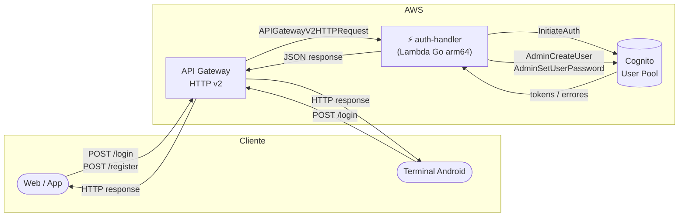
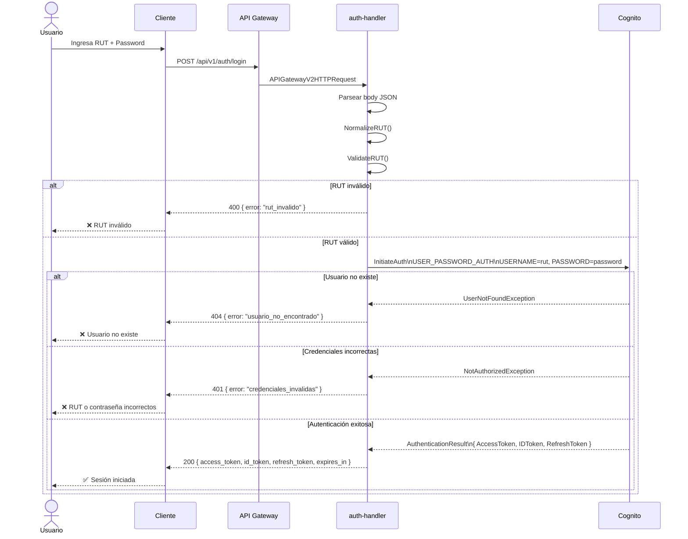
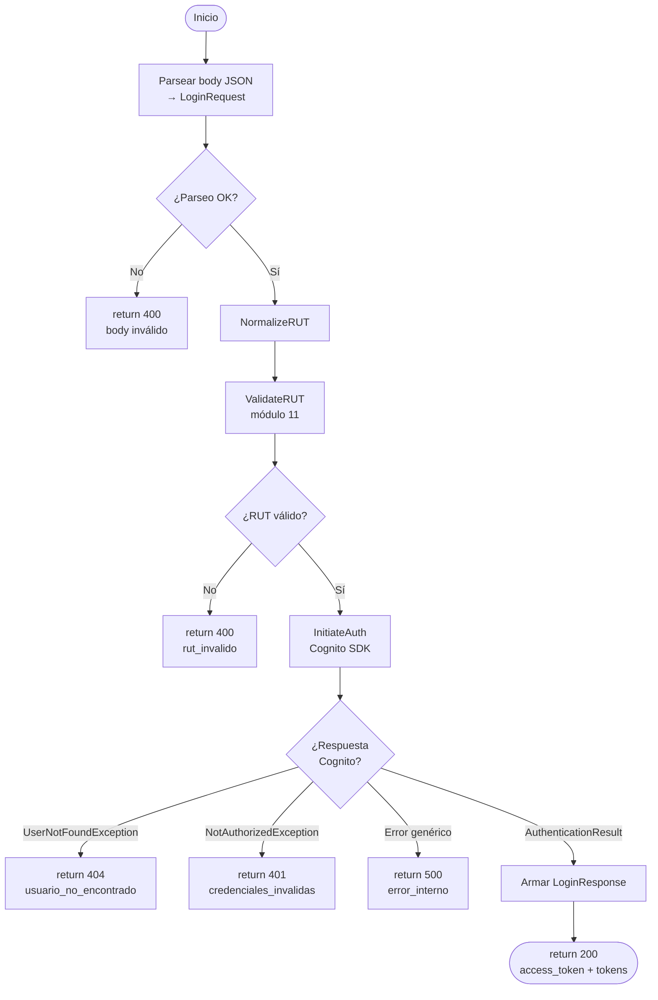
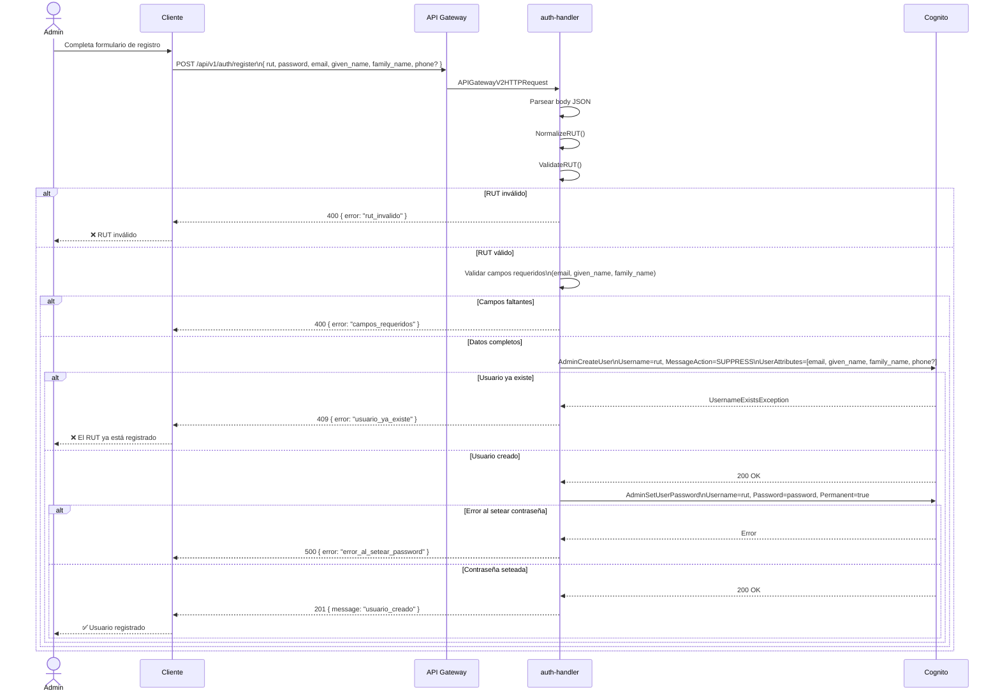
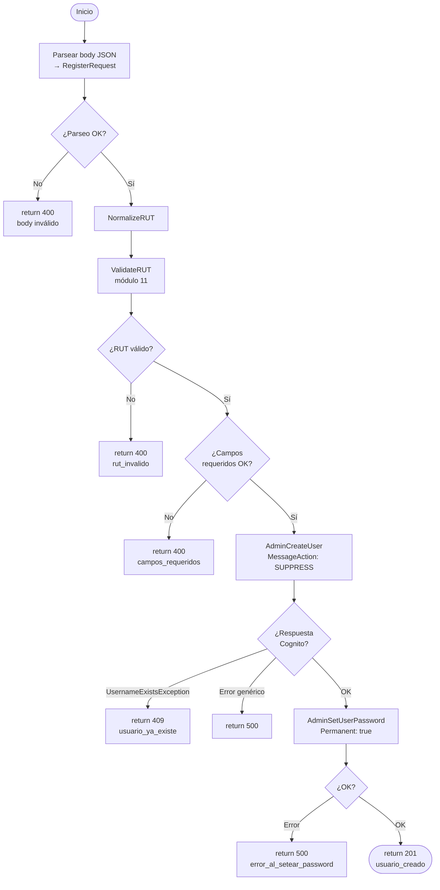
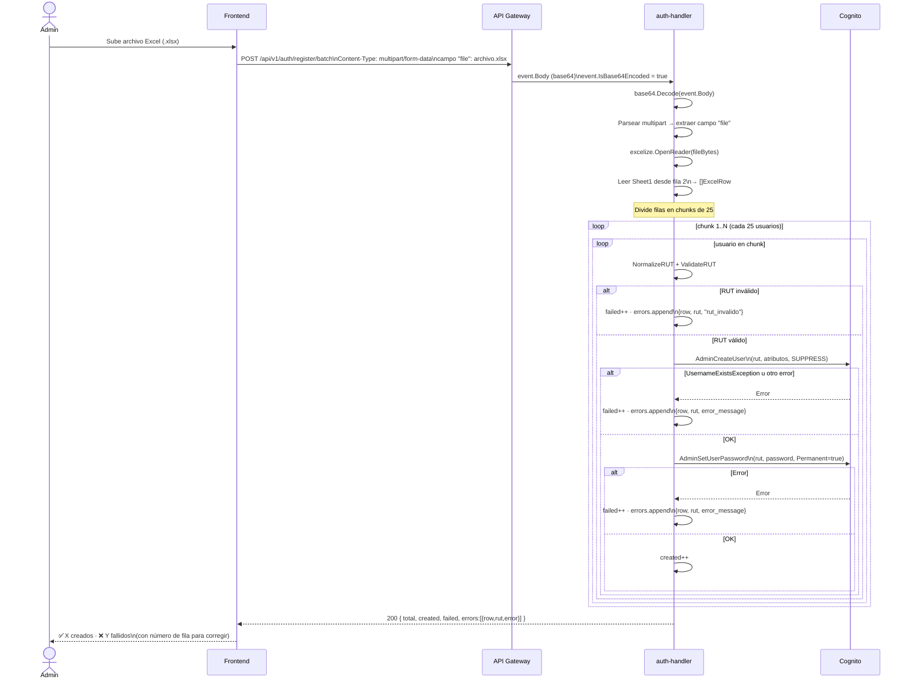
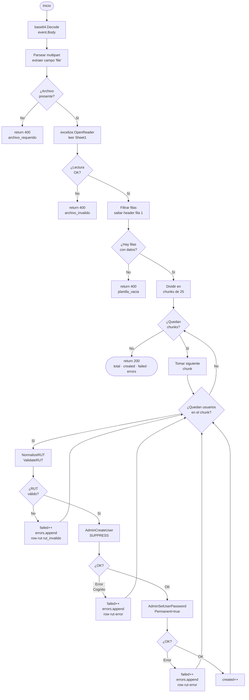

# auth-handler

Lambda en Go que maneja autenticación de usuarios contra Cognito.  
Corre en `provided.al2023` / `arm64`. El binario se llama `bootstrap`.

---

## Arquitectura del componente



---

## Variables de entorno

| Variable | Descripción |
|---|---|
| `COGNITO_USER_POOL_ID` | ID del User Pool (inyectado por Terraform) |
| `COGNITO_CLIENT_ID` | ID del App Client (inyectado por Terraform) |
| `AWS_REGION` | Región AWS (disponible automáticamente en Lambda) |

---

## Endpoints

| Método | Ruta | Auth | Content-Type |
|---|---|---|---|
| `POST` | `/api/v1/auth/login` | Público | `application/json` |
| `POST` | `/api/v1/auth/register` | Público | `application/json` |
| `POST` | `/api/v1/auth/register/batch` | Público | `multipart/form-data` |

El router se resuelve con `event.RouteKey` del evento `APIGatewayV2HTTPRequest`.

---

## Structs Go

```go
// ── Login ──────────────────────────────────────────────────────────────────

type LoginRequest struct {
    RUT      string `json:"rut"`      // ej: "12345678-9"
    Password string `json:"password"`
}

type LoginResponse struct {
    AccessToken  string `json:"access_token"`
    IDToken      string `json:"id_token"`
    RefreshToken string `json:"refresh_token"`
    ExpiresIn    int32  `json:"expires_in"`
}

// ── Registro simple ────────────────────────────────────────────────────────

type RegisterRequest struct {
    RUT         string `json:"rut"`
    Password    string `json:"password"`
    Email       string `json:"email"`
    GivenName   string `json:"given_name"`
    FamilyName  string `json:"family_name"`
    PhoneNumber string `json:"phone_number,omitempty"` // opcional
}

// ── Registro batch ─────────────────────────────────────────────────────────
// El body es multipart/form-data con un campo "file" que contiene el Excel.

type ExcelRow struct {
    RUT         string // columna A
    Password    string // columna B
    Email       string // columna C
    GivenName   string // columna D
    FamilyName  string // columna E
    PhoneNumber string // columna F (opcional)
}

type BatchRegisterResponse struct {
    Total   int          `json:"total"`
    Created int          `json:"created"`
    Failed  int          `json:"failed"`
    Errors  []BatchError `json:"errors,omitempty"`
}

type BatchError struct {
    Row   int    `json:"row"`   // fila en el Excel para que el admin ubique el error
    RUT   string `json:"rut"`
    Error string `json:"error"`
}
```

---

## Lógica de RUT (a implementar manualmente)

El RUT chileno tiene formato `XXXXXXXX-D` donde `D` es el dígito verificador (0-9 o K).

```go
// Entradas aceptadas: "12.345.678-9" | "12345678-9" | "123456789"
// Salida esperada:    "12345678-9"
func NormalizeRUT(raw string) (string, error)

// Algoritmo módulo 11:
// 1. Separar cuerpo numérico y dígito verificador
// 2. Multiplicar cada dígito del cuerpo (derecha → izquierda) por secuencia 2,3,4,5,6,7,2,3,4...
// 3. Sumar productos → resultado = 11 - (suma % 11)
//    - resultado == 11 → dígito "0"
//    - resultado == 10 → dígito "K"
//    - otro           → dígito = resultado como string
// 4. Comparar con el dígito verificador recibido
func ValidateRUT(rut string) bool
```

---

## Flujo 1 — Login

### Diagrama de secuencia



### Diagrama de flujo interno (Lambda)



---

## Flujo 2 — Registro simple (1 usuario)

### Diagrama de secuencia



### Diagrama de flujo interno (Lambda)



---

## Flujo 3 — Registro batch (Excel → Lambda)

El archivo llega directamente a la Lambda como `multipart/form-data`.  
API Gateway HTTP v2 entrega el body en **base64** (`event.IsBase64Encoded = true`).  
La Lambda procesa en **chunks de 25** para respetar el rate limit de Cognito.

### Planilla Excel esperada

La Lambda lee la primera hoja. **Fila 1 = header, se ignora. Datos desde fila 2.**

| A | B | C | D | E | F |
|---|---|---|---|---|---|
| rut | password | email | nombre | apellido | telefono |
| 12345678-9 | Pass123! | juan@mail.com | Juan | Pérez | +56912345678 |
| 87654321-K | Pass456! | maria@mail.com | María | López | *(vacío)* |

### Diagrama de secuencia



### Diagrama de flujo interno (Lambda)



---

## Consideraciones de escala para batch

| Escenario | Recomendación |
|---|---|
| < 500 usuarios | Lambda directa, chunks de 25, timeout 30s es suficiente |
| 500 – 2000 usuarios | Aumentar timeout a 5 min en Terraform (`timeout = 300`) |
| > 2000 usuarios | Subir Excel a S3 → S3 Event → Lambda asíncrona (siguiente fase) |

> El chunk de 25 respeta el rate limit de Cognito (`AdminCreateUser` tiene límite de 50 req/s por defecto).

---

## Llamadas Cognito SDK (Go)

```go
// Login
cognitoClient.InitiateAuth(ctx, &cognitoidentityprovider.InitiateAuthInput{
    AuthFlow: types.AuthFlowTypeUserPasswordAuth,
    ClientId: aws.String(os.Getenv("COGNITO_CLIENT_ID")),
    AuthParameters: map[string]string{
        "USERNAME": rutNormalizado,
        "PASSWORD": password,
    },
})

// Register paso 1 — crear usuario sin enviar email de confirmación
cognitoClient.AdminCreateUser(ctx, &cognitoidentityprovider.AdminCreateUserInput{
    UserPoolId:    aws.String(os.Getenv("COGNITO_USER_POOL_ID")),
    Username:      aws.String(rutNormalizado),
    MessageAction: types.MessageActionTypeSuppress,
    UserAttributes: []types.AttributeType{
        {Name: aws.String("email"),        Value: aws.String(email)},
        {Name: aws.String("given_name"),   Value: aws.String(givenName)},
        {Name: aws.String("family_name"),  Value: aws.String(familyName)},
        {Name: aws.String("phone_number"), Value: aws.String(phone)}, // solo si viene
    },
})

// Register paso 2 — setear contraseña permanente (sin forzar cambio)
cognitoClient.AdminSetUserPassword(ctx, &cognitoidentityprovider.AdminSetUserPasswordInput{
    UserPoolId: aws.String(os.Getenv("COGNITO_USER_POOL_ID")),
    Username:   aws.String(rutNormalizado),
    Password:   aws.String(password),
    Permanent:  true,
})

// Batch — parseo del Excel con excelize
f, err := excelize.OpenReader(bytes.NewReader(fileBytes))
rows, err := f.GetRows("Sheet1")
for i, row := range rows {
    if i == 0 { continue } // saltar header
    // row[0]=RUT, row[1]=Password, row[2]=Email,
    // row[3]=GivenName, row[4]=FamilyName, row[5]=Phone
}
```

**Dependencia Go:**
```bash
go get github.com/xuri/excelize/v2
```

---

## Estructura de archivos sugerida (Go)

```
auth-handler/
├── README.md
├── go.mod
├── go.sum
├── main.go              ← entry point, inicializa cliente Cognito, llama handler.Route()
├── handler.go           ← router por event.RouteKey
├── login.go             ← HandleLogin → InitiateAuth
├── register.go          ← HandleRegister → AdminCreateUser + AdminSetUserPassword
├── register_batch.go    ← HandleBatch → parsea Excel, chunking, llama register por usuario
└── rut/
    ├── normalize.go     ← NormalizeRUT: limpia puntos, espacios, agrega guión
    └── validate.go      ← ValidateRUT: módulo 11
```
