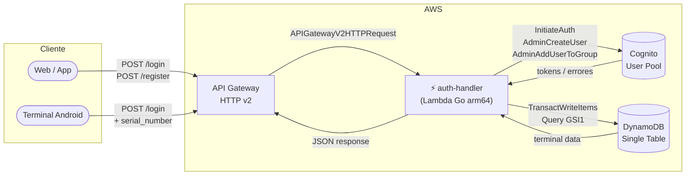
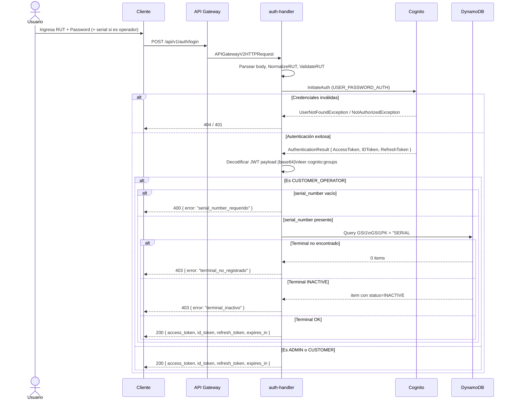
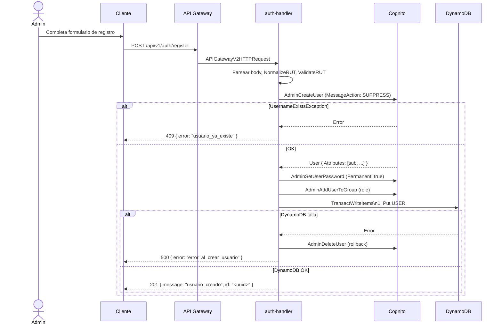
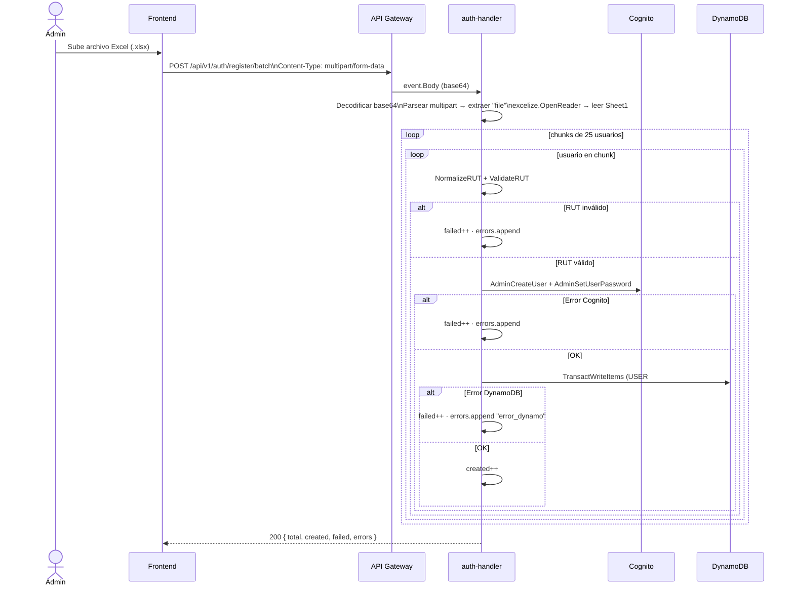

# auth-handler

Lambda en Go que maneja autenticación y registro de usuarios.  
Corre en `provided.al2023` / `arm64`. El binario se llama `bootstrap`.

---

## Arquitectura del componente



---

## Variables de entorno

| Variable | Descripción |
|---|---|
| `COGNITO_USER_POOL_ID` | ID del User Pool (inyectado por Terraform) |
| `COGNITO_CLIENT_ID` | ID del App Client (inyectado por Terraform) |
| `DYNAMODB_TABLE_NAME` | Nombre de la tabla DynamoDB principal (inyectado por Terraform) |
| `AWS_REGION` | Región AWS (disponible automáticamente en Lambda) |

---

## Endpoints

| Método | Ruta | Auth | Content-Type |
|---|---|---|---|
| `POST` | `/api/v1/auth/login` | Público | `application/json` |
| `POST` | `/api/v1/auth/register` | Público | `application/json` |
| `POST` | `/api/v1/auth/register/batch` | Público | `multipart/form-data` |

El router se resuelve con `event.RouteKey` del evento `APIGatewayV2HTTPRequest`.

---

## Structs Go

```go
// ── Login ──────────────────────────────────────────────────────────────────

type LoginRequest struct {
    RUT          string `json:"rut"`
    Password     string `json:"password"`
    SerialNumber string `json:"serial_number,omitempty"` // requerido para CUSTOMER_OPERATOR
}

type LoginResponse struct {
    AccessToken  string `json:"access_token"`
    IDToken      string `json:"id_token"`
    RefreshToken string `json:"refresh_token"`
    ExpiresIn    int32  `json:"expires_in"`
}

// ── Registro simple ────────────────────────────────────────────────────────

type RegisterRequest struct {
    RUT         string `json:"rut"`
    Password    string `json:"password"`
    Email       string `json:"email"`
    GivenName   string `json:"given_name"`
    FamilyName  string `json:"family_name"`
    PhoneNumber string `json:"phone_number,omitempty"`
    Role        string `json:"role,omitempty"`        // default: CUSTOMER_OPERATOR
    CustomerID  string `json:"customer_id,omitempty"`
    LocationID  string `json:"location_id,omitempty"`
}

// ── DynamoDB ───────────────────────────────────────────────────────────────

type UserItem struct {
    PK         string `dynamodbav:"PK"`          // USER#<id>
    SK         string `dynamodbav:"SK"`          // #METADATA
    GSI1PK     string `dynamodbav:"GSI1PK"`      // COGNITO#<cognito_sub>
    GSI1SK     string `dynamodbav:"GSI1SK"`      // USER#<id>
    GSI2PK     string `dynamodbav:"GSI2PK"`      // EMAIL#<email>
    GSI2SK     string `dynamodbav:"GSI2SK"`      // USER#<id>
    ID         string `dynamodbav:"id"`
    RUT        string `dynamodbav:"rut"`
    Email      string `dynamodbav:"email_addr"`  // 'email' es reservada en DynamoDB
    GivenName  string `dynamodbav:"given_name"`
    FamilyName string `dynamodbav:"family_name"`
    Phone      string `dynamodbav:"phone_number,omitempty"`
    Role       string `dynamodbav:"role"`
    Status     string `dynamodbav:"user_status"` // 'status' es reservada en DynamoDB
    CustomerID string `dynamodbav:"customer_id,omitempty"`
    LocationID string `dynamodbav:"location_id,omitempty"`
    CognitoSub string `dynamodbav:"cognito_sub"`
    CreatedAt  string `dynamodbav:"created_at"`
}

// ── Registro batch ─────────────────────────────────────────────────────────
// El body es multipart/form-data con un campo "file" que contiene el Excel.

type BatchRegisterResponse struct {
    Total   int          `json:"total"`
    Created int          `json:"created"`
    Failed  int          `json:"failed"`
    Errors  []BatchError `json:"errors,omitempty"`
}

type BatchError struct {
    Row   int    `json:"row"`
    RUT   string `json:"rut"`
    Error string `json:"error"`
}
```

---

## Flujo 1 — Login

El flujo difiere según el grupo Cognito del usuario:

| Grupo | ¿Necesita `serial_number`? | Validación extra |
|---|---|---|
| `ADMIN` | No | — |
| `CUSTOMER` | No | — |
| `CUSTOMER_OPERATOR` | **Sí** | Terminal debe existir en DynamoDB y no estar `INACTIVE` |

### Diagrama de secuencia



---

## Flujo 2 — Registro simple (1 usuario)

### Diagrama de secuencia



---

## Flujo 3 — Registro batch (Excel → Lambda)

El archivo llega directamente a la Lambda como `multipart/form-data`.  
API Gateway HTTP v2 entrega el body en **base64** (`event.IsBase64Encoded = true`).  
La Lambda procesa en **chunks de 25** para respetar el rate limit de Cognito.

### Planilla Excel esperada

La Lambda lee la primera hoja. **Fila 1 = header, se ignora. Datos desde fila 2.**

| A | B | C | D | E | F |
|---|---|---|---|---|---|
| rut | nombre | apellido | email | password | telefono |
| 12345678-5 | Juan | Pérez | juan@mail.com | Pass123! | +56912345678 |
| 87654321-K | María | López | maria@mail.com | Pass456! | *(vacío)* |

> Todos los usuarios creados por batch reciben el rol `CUSTOMER_OPERATOR` por defecto.

### Diagrama de secuencia



---

## Consideraciones de escala para batch

| Escenario | Recomendación |
|---|---|
| < 500 usuarios | Lambda directa, chunks de 25, timeout 30s es suficiente |
| 500 – 2000 usuarios | Aumentar timeout a 5 min en Terraform (`timeout = 300`) |
| > 2000 usuarios | Subir Excel a S3 → S3 Event → Lambda asíncrona (siguiente fase) |

---

## cURL de prueba

Base URL: `https://qnehzrs7g4.execute-api.us-east-1.amazonaws.com`

### Login — usuario web (ADMIN / CUSTOMER)

```bash
curl -s -X POST https://qnehzrs7g4.execute-api.us-east-1.amazonaws.com/api/v1/auth/login \
  -H "Content-Type: application/json" \
  -d '{"rut":"12345678-5","password":"Temporal123!"}' | jq
```

### Login — operador en terminal

```bash
curl -s -X POST https://qnehzrs7g4.execute-api.us-east-1.amazonaws.com/api/v1/auth/login \
  -H "Content-Type: application/json" \
  -d '{"rut":"12345678-5","password":"Temporal123!","serial_number":"TUU-2024-001"}' | jq
```

Errores posibles login:

| Status | `error` | Causa |
|--------|---------|-------|
| 400 | `rut_invalido` | RUT no pasa módulo 11 |
| 400 | `serial_number_requerido` | Operador sin serial |
| 401 | `credenciales_invalidas` | Contraseña incorrecta |
| 403 | `terminal_no_registrado` | Serial no existe en DynamoDB |
| 403 | `terminal_inactivo` | Terminal con status INACTIVE |
| 404 | `usuario_no_encontrado` | RUT no existe en Cognito |

### Register — operador con rol

```bash
curl -s -X POST https://qnehzrs7g4.execute-api.us-east-1.amazonaws.com/api/v1/auth/register \
  -H "Content-Type: application/json" \
  -d '{
    "rut": "12345678-5",
    "password": "Temporal123!",
    "email": "juan.perez@example.com",
    "given_name": "Juan",
    "family_name": "Pérez",
    "role": "CUSTOMER_OPERATOR",
    "customer_id": "c0c0c0c0-0000-0000-0000-000000000000"
  }' | jq
```

Respuesta esperada (`201`):
```json
{ "message": "usuario_creado", "id": "a1b2c3d4-..." }
```

### Register batch — archivo Excel

```bash
curl -s -X POST https://qnehzrs7g4.execute-api.us-east-1.amazonaws.com/api/v1/auth/register/batch \
  -F "file=@/ruta/al/archivo.xlsx" | jq
```

---

## Estructura de archivos

```
auth-handler/
├── README.md
├── go.mod
├── go.sum
├── docs/
│   └── openapi.yaml
├── main.go              ← entry point, inicializa clientes Cognito y DynamoDB
├── handler.go           ← Handler struct, router por event.RouteKey, jsonResponse
├── login.go             ← HandleLogin, tokenHasGroup, validateTerminal
├── register.go          ← HandleRegister, createCognitoUser
├── dynamo.go            ← UserItem struct, writeUserRecord (TransactWrite)
├── register_batch.go    ← HandleBatch: parsea Excel, chunking
└── rut/
    ├── normalize.go
    └── validate.go
```

---

## RUTs válidos para test rápido

| RUT | Dígito verificador |
|-----|--------------------|
| `12345678-5` | 5 |
| `11111111-1` | 1 |
| `98765432-1` | 1 |
