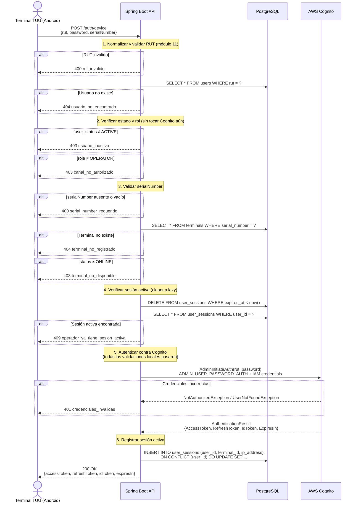

# US-001 — Login de Operador desde Terminal POS

## Historia de Usuario

**Como** operador de estacionamiento,  
**quiero** autenticarme en la terminal TUU con mi RUT y contraseña,  
**para** poder registrar ingresos y egresos de vehículos en mi turno.

---

## Criterios de Aceptación

| # | Criterio |
|---|----------|
| AC-1 | El operador ingresa RUT y contraseña. El sistema retorna un access token, refresh token e id token válidos. |
| AC-2 | Si el RUT tiene formato inválido (módulo 11 falla), el sistema retorna `400 Bad Request` con código `rut_invalido`. |
| AC-3 | Si el RUT no existe en la base de datos, el sistema retorna `404 Not Found` con código `usuario_no_encontrado`. |
| AC-4 | Si el usuario existe pero su estado es `INACTIVE`, el sistema retorna `403 Forbidden` con código `usuario_inactivo`. |
| AC-5 | Si el rol del usuario no es `OPERATOR`, el sistema retorna `403 Forbidden` con código `canal_no_autorizado`. |
| AC-6 | Si el campo `serialNumber` está ausente o vacío, el sistema retorna `400 Bad Request` con código `serial_number_requerido`. |
| AC-7 | Si el terminal con el `serialNumber` dado no existe, el sistema retorna `404 Not Found` con código `terminal_no_registrado`. |
| AC-8 | Si el terminal existe pero su estado no es `ONLINE`, el sistema retorna `403 Forbidden` con código `terminal_no_disponible`. |
| AC-9 | Si el operador ya tiene una sesión activa en cualquier terminal, el sistema retorna `409 Conflict` con código `operador_ya_tiene_sesion_activa`. |
| AC-10 | Si las credenciales son incorrectas según Cognito, el sistema retorna `401 Unauthorized` con código `credenciales_invalidas` (mismo mensaje para usuario inexistente en Cognito, para evitar enumeración). |
| AC-11 | Al autenticar exitosamente, el sistema registra la sesión activa en `user_sessions` vinculada al terminal. |

---

## Reglas de Negocio

- **Solo OPERATOR** puede usar este endpoint. ADMIN y CUSTOMER se autentican directamente contra Cognito desde el dashboard web.
- **`serialNumber` es obligatorio** para OPERATOR. No existe login de OPERATOR sin terminal física registrada.
- **Sesión única por operador**: un OPERATOR no puede tener dos sesiones activas simultáneas. Debe cerrar la sesión anterior antes de iniciar una nueva.
- **Validaciones de negocio antes de Cognito**: el orden garantiza que no se consume el rate limit de autenticación de Cognito para usuarios inválidos, terminales inexistentes o sesiones duplicadas.
- Las sesiones expiradas se limpian de forma **lazy** en cada intento de login (no hay job periódico).

---

## Endpoint

```
POST /auth/device
Content-Type: application/json
Authorization: (ninguna — endpoint público)
```

### Request

```json
{
  "rut":          "33333333-3",
  "password":     "Operator.2024#",
  "serialNumber": "TUU-TEST-001"
}
```

### Response exitoso `200 OK`

```json
{
  "accessToken":  "eyJraWQiOiJ...",
  "refreshToken": "eyJjdHkiOiJ...",
  "idToken":      "eyJraWQiOiJ...",
  "expiresIn":    3600
}
```

### Respuestas de error

| HTTP | Código de error                      | Causa |
|------|--------------------------------------|-------|
| 400  | `rut_invalido`                       | RUT con formato o dígito verificador incorrecto |
| 400  | `serial_number_requerido`            | Campo `serialNumber` ausente o vacío |
| 401  | `credenciales_invalidas`             | Contraseña incorrecta o usuario inexistente en Cognito |
| 403  | `usuario_inactivo`                   | El usuario existe pero está desactivado |
| 403  | `canal_no_autorizado`                | El rol no es OPERATOR |
| 403  | `terminal_no_disponible`             | El terminal existe pero no está ONLINE |
| 404  | `usuario_no_encontrado`              | RUT no registrado en PostgreSQL |
| 404  | `terminal_no_registrado`             | `serialNumber` no registrado |
| 409  | `operador_ya_tiene_sesion_activa`    | El operador ya tiene sesión abierta en otro terminal |

---

## Diagrama de Secuencia



---

## Notas de Implementación

- **`POST /auth/device` es público** (`permitAll()` en `SecurityConfig`). No requiere JWT porque es precisamente el endpoint que emite el primer token.
- El flujo `ADMIN_USER_PASSWORD_AUTH` requiere credenciales IAM del servidor. El POS nunca habla directamente con Cognito — siempre pasa por el backend, lo que hace posible la validación de terminal y sesión.
- El `upsert` de `user_sessions` usa `ON CONFLICT (user_id) DO UPDATE` para reemplazar atómicamente la sesión anterior si existía (ej: expirada pero no limpiada). La restricción `UNIQUE (user_id)` en la tabla garantiza que nunca haya dos filas para el mismo operador.
- Los errores `UserNotFoundException` y `NotAuthorizedException` de Cognito se mapean al **mismo mensaje** (`credenciales_invalidas`) para no revelar si el usuario existe en Cognito.

---

## Archivos Relacionados

| Archivo | Rol |
|---------|-----|
| `auth/AuthController.java` | Controlador REST — recibe el request, extrae IP |
| `auth/AuthService.java` | Lógica de negocio — orquesta los pasos 1-6 |
| `auth/DeviceLoginRequest.java` | Record del body del request |
| `auth/TokenResponse.java` | Record de la respuesta exitosa |
| `shared/rut/RutUtils.java` | Normalización y validación de RUT (módulo 11) |
| `shared/cognito/CognitoAdminClient.java` | Wrapper del SDK v2 — llama `AdminInitiateAuth` |
| `user/UserRepository.java` | `findByRut()` — lookup pre-Cognito |
| `terminal/TerminalRepository.java` | `findBySerialNumber()` — validación del terminal |
| `session/SessionRepository.java` | `deleteExpired()`, `findByUserId()`, `upsert()` |
| `docker/init/02_seed.sql` | Datos de prueba — OPERATOR RUT `33333333-3` |
