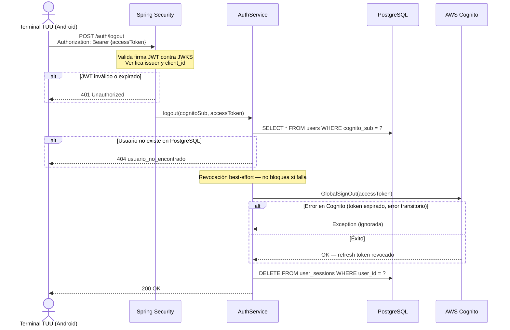

# US-002 — Logout del Operador

## Historia de Usuario

**Como** operador de estacionamiento,  
**quiero** cerrar mi sesión en la terminal TUU al finalizar mi turno,  
**para** que ningún otro operador pueda operar bajo mi identidad en ese terminal.

---

## Criterios de Aceptación

| # | Criterio |
|---|----------|
| AC-1 | El operador envía su access token. El sistema invalida el refresh token en Cognito y elimina la sesión activa en PostgreSQL. Retorna `200 OK`. |
| AC-2 | Si el JWT es inválido o está expirado, Spring Security rechaza la petición con `401 Unauthorized` antes de llegar al controlador. |
| AC-3 | Si el `cognito_sub` del JWT no existe en PostgreSQL, el sistema retorna `404 Not Found` con código `usuario_no_encontrado`. |
| AC-4 | Si la revocación en Cognito falla (token ya expirado, error transitorio), la sesión en PostgreSQL se elimina igualmente. La operación nunca falla por un error de Cognito. |
| AC-5 | Tras el logout, el operador no puede iniciar una nueva sesión en ningún terminal hasta volver a autenticarse con `POST /auth/device`. |

---

## Reglas de Negocio

- El **access token actual sigue siendo técnicamente válido** hasta su expiración natural (~1h) porque el protocolo OAuth2 no permite revocar access tokens. Lo que se revoca es el **refresh token**, impidiendo que el dispositivo obtenga nuevos access tokens.
- En la práctica el POS descarta ambos tokens al recibir la respuesta exitosa.
- La revocación en Cognito es **best-effort**: garantizar la eliminación de la sesión local es más importante que la revocación remota.
- El endpoint requiere un JWT válido en el header `Authorization: Bearer`.

---

## Endpoint

```
POST /auth/logout
Authorization: Bearer {accessToken}
```

### Request

Sin body.

### Response exitoso `200 OK`

Sin body.

### Respuestas de error

| HTTP | Código de error           | Causa |
|------|---------------------------|-------|
| 401  | —                         | JWT ausente, inválido o expirado (rechazado por Spring Security) |
| 404  | `usuario_no_encontrado`   | El `sub` del JWT no tiene fila en PostgreSQL |

---

## Diagrama de Secuencia



---

## Notas de Implementación

- Spring Security extrae el `sub` del JWT y lo expone como `@AuthenticationPrincipal Jwt`. El controlador lo pasa al service junto con el `tokenValue` para la llamada a `GlobalSignOut`.
- `GlobalSignOut` (sin prefijo `Admin`) usa el propio access token del usuario — no requiere credenciales IAM. Es el único endpoint de auth que el usuario puede llamar con sus propios tokens.
- `AdminUserGlobalSignOut` (con prefijo `Admin`, usado en US-003) sí requiere IAM y lo llama el ADMIN sobre otro usuario.

---

## Archivos Relacionados

| Archivo | Rol |
|---------|-----|
| `auth/AuthController.java` | `POST /auth/logout` — extrae `Jwt` del principal |
| `auth/AuthService.java` | `logout(cognitoSub, accessToken)` |
| `shared/cognito/CognitoAdminClient.java` | `globalSignOut(accessToken)` — revoca refresh token |
| `user/UserRepository.java` | `findByCognitoSub()` |
| `session/SessionRepository.java` | `deleteByUserId()` |
