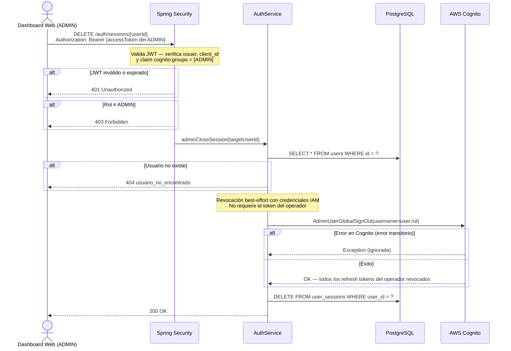

# US-003 — Cierre Remoto de Sesión por ADMIN

## Historia de Usuario

**Como** administrador del sistema,  
**quiero** forzar el cierre de sesión de cualquier operador desde el dashboard web,  
**para** liberar un terminal bloqueado o revocar el acceso de un operador de forma inmediata.

---

## Criterios de Aceptación

| # | Criterio |
|---|----------|
| AC-1 | El ADMIN envía el UUID interno del operador. El sistema revoca sus refresh tokens en Cognito y elimina su sesión en PostgreSQL. Retorna `200 OK`. |
| AC-2 | Solo usuarios con rol `ADMIN` pueden usar este endpoint. Cualquier otro rol recibe `403 Forbidden`. |
| AC-3 | Si el JWT es inválido o está expirado, Spring Security rechaza la petición con `401 Unauthorized`. |
| AC-4 | Si el `userId` dado no existe en PostgreSQL, el sistema retorna `404 Not Found` con código `usuario_no_encontrado`. |
| AC-5 | Si la revocación en Cognito falla (error transitorio), la sesión local se elimina igualmente. |
| AC-6 | El operador cuya sesión fue cerrada no puede renovar tokens. Su access token actual expira naturalmente (~1h). |

---

## Reglas de Negocio

- Solo accesible para rol `ADMIN` — protegido con `@PreAuthorize("hasRole('ADMIN')")`.
- Usa `AdminUserGlobalSignOut` (con prefijo `Admin`) que requiere credenciales IAM del servidor. El ADMIN no necesita tener el access token del operador.
- La revocación en Cognito es **best-effort**: si Cognito falla, la sesión local se elimina de todas formas para liberar el terminal.
- El acceso con el access token vigente del operador sigue funcionando hasta que expire (~1h). Este es un límite del protocolo OAuth2 — no hay forma de invalidar access tokens en Cognito.
- El `userId` es el UUID interno de PostgreSQL, no el `cognito_sub`. El ADMIN lo obtiene del listado de usuarios del dashboard.

---

## Endpoint

```
DELETE /auth/sessions/{userId}
Authorization: Bearer {accessToken del ADMIN}
```

### Parámetro de ruta

| Parámetro | Tipo | Descripción |
|-----------|------|-------------|
| `userId`  | UUID | ID interno del operador en PostgreSQL |

### Request

Sin body.

### Response exitoso `200 OK`

Sin body.

### Respuestas de error

| HTTP | Código de error           | Causa |
|------|---------------------------|-------|
| 401  | —                         | JWT ausente, inválido o expirado |
| 403  | —                         | El caller no tiene rol ADMIN |
| 404  | `usuario_no_encontrado`   | El `userId` no existe en PostgreSQL |

---

## Diagrama de Secuencia



---

## Notas de Implementación

- `AdminUserGlobalSignOut` recibe el **username** (RUT del operador en Cognito), no su UUID interno. Por eso `UserRepository.findById()` carga todo el `User` record, incluyendo el campo `rut`.
- La diferencia entre `GlobalSignOut` (US-002) y `AdminUserGlobalSignOut` (US-003): el primero usa el token del propio usuario, el segundo usa credenciales IAM del servidor y puede actuar sobre cualquier usuario.
- Spring evalúa `@PreAuthorize("hasRole('ADMIN')")` después de que el filtro JWT valida el token. El claim `cognito:groups` se convierte en `ROLE_ADMIN` por `JwtGrantedAuthoritiesConverter` en `SecurityConfig`.

---

## Archivos Relacionados

| Archivo | Rol |
|---------|-----|
| `auth/AuthController.java` | `DELETE /auth/sessions/{userId}` — `@PreAuthorize("hasRole('ADMIN')")` |
| `auth/AuthService.java` | `adminCloseSession(targetUserId)` |
| `shared/cognito/CognitoAdminClient.java` | `globalSignOutAdmin(username)` — usa IAM |
| `user/UserRepository.java` | `findById()` — obtiene el `rut` para Cognito |
| `session/SessionRepository.java` | `deleteByUserId()` |
| `config/SecurityConfig.java` | `JwtGrantedAuthoritiesConverter` — mapea `cognito:groups` → `ROLE_*` |
