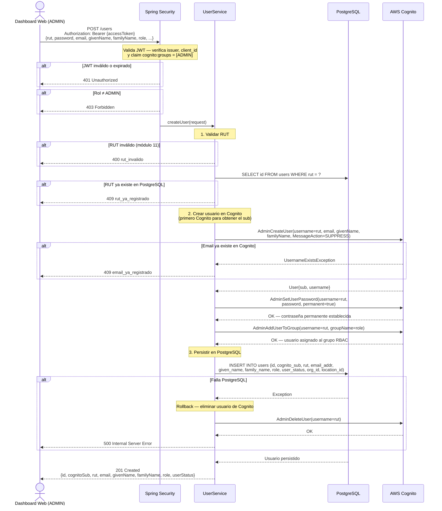

# US-004 — Registro de Usuario

## Historia de Usuario

**Como** administrador del sistema,  
**quiero** crear nuevos usuarios (ADMIN, CUSTOMER u OPERATOR) desde el dashboard,  
**para** darles acceso al sistema con el rol y la organización que les corresponde.

---

## Criterios de Aceptación

| # | Criterio |
|---|----------|
| AC-1 | El ADMIN envía los datos del nuevo usuario. El sistema lo crea en Cognito y en PostgreSQL. Retorna `201 Created` con el UUID interno. |
| AC-2 | Solo usuarios con rol `ADMIN` pueden crear usuarios de cualquier rol. Un `CUSTOMER` solo puede crear `OPERATOR` dentro de su propia organización. |
| AC-3 | Si el RUT tiene formato inválido, retorna `400 Bad Request` con código `rut_invalido`. |
| AC-4 | Si el RUT ya existe en PostgreSQL, retorna `409 Conflict` con código `rut_ya_registrado`. |
| AC-5 | Si el email ya existe en Cognito, retorna `409 Conflict` con código `email_ya_registrado`. |
| AC-6 | Si la creación en PostgreSQL falla después de crear el usuario en Cognito, el sistema hace rollback eliminando al usuario de Cognito. El estado final es consistente. |
| AC-7 | El usuario creado queda en estado `ACTIVE` y con contraseña permanente (no temporal). No se envían emails de bienvenida desde Cognito. |
| AC-8 | El usuario es asignado al grupo Cognito correspondiente a su rol (`ADMIN`, `CUSTOMER`, `OPERATOR`). |

---

## Reglas de Negocio

- El **RUT es el username en Cognito**. Debe ser único en el User Pool.
- La contraseña se establece como **permanente** (`AdminSetUserPassword` con `permanent=true`). Evita el flujo de cambio de contraseña obligatorio en el primer login.
- `MessageAction.SUPPRESS` en `AdminCreateUser` suprime el email de invitación de Cognito — la gestión de contraseñas es responsabilidad del backend.
- **Orden de operaciones**: primero Cognito, luego PostgreSQL. Si falla PostgreSQL, se hace rollback en Cognito (`AdminDeleteUser`). Si falla Cognito, no hay nada que revertir.
- `custom:role` se establece como atributo de Cognito para display en la app, pero **la autorización real** se basa en `cognito:groups` (el claim del JWT), no en este atributo.

---

## Endpoint

```
POST /users
Authorization: Bearer {accessToken del ADMIN}
Content-Type: application/json
```

### Request

```json
{
  "rut":         "44444444-4",
  "password":    "NuevoUser.2024#",
  "email":       "nuevo@ejemplo.cl",
  "givenName":   "Juan",
  "familyName":  "Pérez",
  "phoneNumber": "+56912345678",
  "role":        "OPERATOR",
  "orgId":       "aaaaaaaa-aaaa-aaaa-aaaa-aaaaaaaaaaaa",
  "locationId":  "bbbbbbbb-bbbb-bbbb-bbbb-bbbbbbbbbbbb"
}
```

> `orgId` y `locationId` son opcionales según el rol. OPERATOR requiere ambos. CUSTOMER requiere `orgId`. ADMIN no requiere ninguno.

### Response exitoso `201 Created`

```json
{
  "id":          "cccccccc-cccc-cccc-cccc-cccccccccccc",
  "cognitoSub":  "xxxxxxxx-xxxx-xxxx-xxxx-xxxxxxxxxxxx",
  "rut":         "44444444-4",
  "email":       "nuevo@ejemplo.cl",
  "givenName":   "Juan",
  "familyName":  "Pérez",
  "role":        "OPERATOR",
  "userStatus":  "ACTIVE"
}
```

### Respuestas de error

| HTTP | Código de error          | Causa |
|------|--------------------------|-------|
| 400  | `rut_invalido`           | RUT con formato o dígito verificador incorrecto |
| 400  | `rol_invalido`           | Rol no es ADMIN, CUSTOMER ni OPERATOR |
| 401  | —                        | JWT ausente, inválido o expirado |
| 403  | —                        | El caller no tiene permiso para crear ese rol |
| 409  | `rut_ya_registrado`      | El RUT ya existe en PostgreSQL |
| 409  | `email_ya_registrado`    | El email ya existe en Cognito |

---

## Diagrama de Secuencia



---

## Notas de Implementación

- **Orden Cognito → PostgreSQL** es intencional. El `cognito_sub` (UUID que Cognito asigna) se necesita para insertar en `users.cognito_sub`. Si fuera al revés, habría que hacer un `SELECT` extra a Cognito para obtenerlo.
- El rollback con `AdminDeleteUser` es sícrono y best-effort. Si también falla el rollback, quedará un usuario huérfano en Cognito sin fila en PostgreSQL — no podrá autenticarse porque el hot path de auth busca por `cognito_sub` en PostgreSQL. Se puede detectar con una tarea de reconciliación periódica.
- `custom:role` en Cognito es solo para display en la UI. **La autorización** se basa exclusivamente en `cognito:groups` que se incluye en el JWT como claim `cognito:groups`.
- La contraseña **nunca se persiste** en PostgreSQL — Cognito es el único que la conoce.

---

## Archivos Relacionados

| Archivo | Rol |
|---------|-----|
| `user/UserController.java` | `POST /users` — `@PreAuthorize("hasRole('ADMIN')")` |
| `user/UserService.java` | `createUser(request)` — orquesta Cognito + PostgreSQL |
| `user/CreateUserRequest.java` | Record del body del request |
| `user/UserResponse.java` | Record de la respuesta |
| `user/UserRepository.java` | `existsByRut()`, `insert()` |
| `shared/rut/RutUtils.java` | Validación del RUT antes de crear |
| `shared/cognito/CognitoAdminClient.java` | `createUser()`, `addUserToGroup()`, `deleteUser()` |
