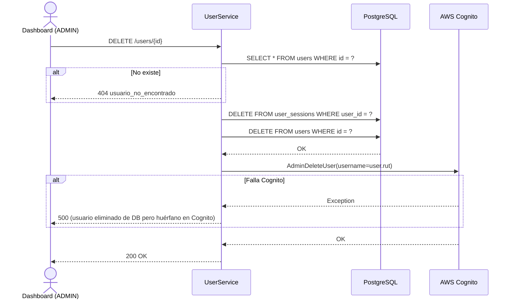
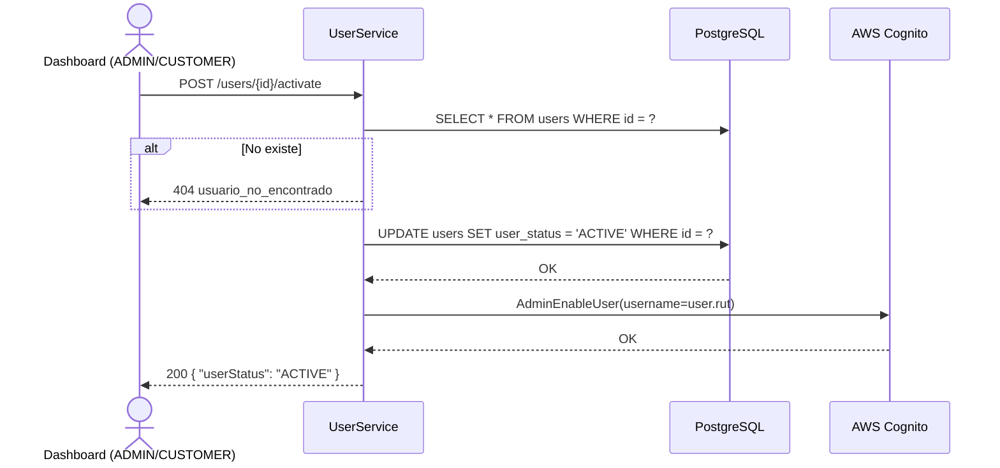

# US-005 — CRUD de Usuarios

## Historias de Usuario

| ID | Historia |
|----|----------|
| US-005-A | **Como** ADMIN, **quiero** listar todos los usuarios del sistema, **para** tener visibilidad de quién tiene acceso. |
| US-005-B | **Como** CUSTOMER, **quiero** listar los usuarios de mi organización, **para** gestionar a mis operadores. |
| US-005-C | **Como** ADMIN o CUSTOMER, **quiero** ver el detalle de un usuario específico, **para** revisar su información. |
| US-005-D | **Como** ADMIN o CUSTOMER, **quiero** actualizar los datos de un usuario, **para** mantener la información vigente. |
| US-005-E | **Como** ADMIN, **quiero** eliminar un usuario, **para** revocar su acceso de forma permanente. |
| US-005-F | **Como** ADMIN o CUSTOMER, **quiero** activar o desactivar un usuario, **para** suspender el acceso temporalmente sin eliminar la cuenta. |
| US-005-G | **Como** ADMIN, **quiero** resetear la contraseña de un usuario, **para** ayudarlo a recuperar el acceso. |

---

## Modelo de Datos

```json
{
  "id":          "uuid",
  "cognitoSub":  "uuid-cognito",
  "rut":         "33333333-3",
  "email":       "operador@empresa.cl",
  "givenName":   "Juan",
  "familyName":  "Pérez",
  "phoneNumber": "+56912345678",
  "role":        "OPERATOR",
  "userStatus":  "ACTIVE",
  "orgId":       "uuid-org",
  "locationId":  "uuid-location",
  "createdAt":   "2024-01-15T10:30:00Z"
}
```

---

## Endpoints

| Método | Ruta | Rol mínimo | Descripción |
|--------|------|------------|-------------|
| `GET`    | `/users`                      | CUSTOMER | Listar usuarios |
| `GET`    | `/users/{id}`                 | OPERATOR | Ver detalle propio / ADMIN y CUSTOMER ven cualquiera |
| `PUT`    | `/users/{id}`                 | OPERATOR | Actualizar perfil propio / ADMIN y CUSTOMER actualizan cualquiera |
| `DELETE` | `/users/{id}`                 | ADMIN    | Eliminar usuario |
| `POST`   | `/users/{id}/activate`        | CUSTOMER | Activar usuario |
| `POST`   | `/users/{id}/deactivate`      | CUSTOMER | Desactivar usuario |
| `POST`   | `/users/{id}/reset-password`  | ADMIN    | Resetear contraseña |

---

## US-005-A y B — Listar Usuarios

### Criterios de Aceptación

| # | Criterio |
|---|----------|
| AC-1 | ADMIN sin `?org_id` retorna todos los usuarios (máx. 50). |
| AC-2 | ADMIN con `?org_id=<uuid>` retorna solo los usuarios de esa organización. |
| AC-3 | CUSTOMER debe enviar `?org_id=<uuid>` de su propia organización. Si omite el parámetro, retorna `400` con `org_id_requerido`. |
| AC-4 | OPERATOR no puede listar usuarios — retorna `403 Forbidden`. |
| AC-5 | Si la organización no tiene usuarios, retorna `200 OK` con lista vacía `[]`. |

### Request

```
GET /users
GET /users?org_id=aaaaaaaa-aaaa-aaaa-aaaa-aaaaaaaaaaaa
Authorization: Bearer {accessToken}
```

### Response `200 OK`

```json
[
  {
    "id": "eeeeeeee-eeee-eeee-eeee-eeeeeeeeeeee",
    "rut": "33333333-3",
    "email": "operador@empresa.cl",
    "givenName": "Juan",
    "familyName": "Pérez",
    "role": "OPERATOR",
    "userStatus": "ACTIVE",
    "orgId": "aaaaaaaa-aaaa-aaaa-aaaa-aaaaaaaaaaaa"
  }
]
```

### Errores

| HTTP | Código | Causa |
|------|--------|-------|
| 400  | `org_id_requerido` | CUSTOMER no envió `?org_id` |
| 403  | — | OPERATOR intentó listar |

---

## US-005-C — Obtener Usuario

### Criterios de Aceptación

| # | Criterio |
|---|----------|
| AC-1 | ADMIN y CUSTOMER pueden ver cualquier usuario por su ID. |
| AC-2 | OPERATOR solo puede ver su propio perfil. Si intenta ver otro usuario, retorna `403 Forbidden`. |
| AC-3 | Si el ID no existe, retorna `404 Not Found` con `usuario_no_encontrado`. |

### Request

```
GET /users/{id}
Authorization: Bearer {accessToken}
```

### Response `200 OK`

```json
{
  "id": "eeeeeeee-eeee-eeee-eeee-eeeeeeeeeeee",
  "cognitoSub": "xxxxxxxx-xxxx-xxxx-xxxx-xxxxxxxxxxxx",
  "rut": "33333333-3",
  "email": "operador@empresa.cl",
  "givenName": "Juan",
  "familyName": "Pérez",
  "phoneNumber": "+56912345678",
  "role": "OPERATOR",
  "userStatus": "ACTIVE",
  "orgId": "aaaaaaaa-aaaa-aaaa-aaaa-aaaaaaaaaaaa",
  "locationId": "bbbbbbbb-bbbb-bbbb-bbbb-bbbbbbbbbbbb",
  "createdAt": "2024-01-15T10:30:00Z"
}
```

### Errores

| HTTP | Código | Causa |
|------|--------|-------|
| 403  | — | OPERATOR intentó ver a otro usuario |
| 404  | `usuario_no_encontrado` | El ID no existe |

---

## US-005-D — Actualizar Usuario

### Criterios de Aceptación

| # | Criterio |
|---|----------|
| AC-1 | ADMIN y CUSTOMER pueden actualizar cualquier usuario. |
| AC-2 | OPERATOR solo puede actualizar su propio perfil. |
| AC-3 | Campos actualizables: `email`, `givenName`, `familyName`, `phoneNumber`, `locationId`. El `role`, `rut` y `userStatus` no son modificables por este endpoint. |
| AC-4 | Si el body no contiene ningún campo válido, retorna `400` con `sin_campos_para_actualizar`. |
| AC-5 | Si el ID no existe, retorna `404`. |

### Request

```
PUT /users/{id}
Authorization: Bearer {accessToken}
Content-Type: application/json

{
  "givenName":   "Juan Carlos",
  "phoneNumber": "+56987654321"
}
```

### Response `200 OK`

Retorna el usuario completo con los cambios aplicados.

### Errores

| HTTP | Código | Causa |
|------|--------|-------|
| 400  | `sin_campos_para_actualizar` | Body sin campos válidos |
| 403  | — | OPERATOR intentó actualizar a otro usuario |
| 404  | `usuario_no_encontrado` | El ID no existe |

---

## US-005-E — Eliminar Usuario

### Criterios de Aceptación

| # | Criterio |
|---|----------|
| AC-1 | Solo ADMIN puede eliminar usuarios. |
| AC-2 | La eliminación es atómica: primero PostgreSQL, luego Cognito (`AdminDeleteUser`). |
| AC-3 | Si el usuario tiene una sesión activa en `user_sessions`, se elimina también. |
| AC-4 | Si el ID no existe, retorna `404`. |
| AC-5 | Tras la eliminación el usuario no puede autenticarse — su RUT y `cognitoSub` quedan liberados. |

### Request

```
DELETE /users/{id}
Authorization: Bearer {accessToken del ADMIN}
```

### Response `200 OK`

Sin body.

### Diagrama de Secuencia



### Errores

| HTTP | Código | Causa |
|------|--------|-------|
| 403  | — | El caller no es ADMIN |
| 404  | `usuario_no_encontrado` | El ID no existe |

---

## US-005-F — Activar / Desactivar Usuario

### Criterios de Aceptación

| # | Criterio |
|---|----------|
| AC-1 | ADMIN o CUSTOMER pueden activar/desactivar usuarios. |
| AC-2 | El cambio de estado se aplica en PostgreSQL (`user_status`) y se refleja en Cognito (`AdminEnableUser` / `AdminDisableUser`). |
| AC-3 | Un usuario desactivado que intenta hacer login recibe `403 usuario_inactivo` (validado antes de llamar a Cognito). |
| AC-4 | Si el ID no existe, retorna `404`. |

### Requests

```
POST /users/{id}/activate
POST /users/{id}/deactivate
Authorization: Bearer {accessToken}
```

Sin body.

### Response `200 OK`

```json
{ "userStatus": "ACTIVE" }
```

### Diagrama de Secuencia



---

## US-005-G — Reset de Contraseña

### Criterios de Aceptación

| # | Criterio |
|---|----------|
| AC-1 | Solo ADMIN puede resetear la contraseña de otro usuario. |
| AC-2 | La nueva contraseña debe cumplir la password policy del User Pool (mín. 10 caracteres, mayúsculas, minúsculas, números). |
| AC-3 | La contraseña se establece como permanente — el usuario no necesita cambiarla en el próximo login. |
| AC-4 | La contraseña nunca se persiste en PostgreSQL. |
| AC-5 | Si el ID no existe, retorna `404`. |

### Request

```
POST /users/{id}/reset-password
Authorization: Bearer {accessToken del ADMIN}
Content-Type: application/json

{
  "newPassword": "NuevaClave.2024#"
}
```

### Response `200 OK`

Sin body.

### Errores

| HTTP | Código | Causa |
|------|--------|-------|
| 400  | `new_password_requerido` | Campo `newPassword` ausente o vacío |
| 403  | — | El caller no es ADMIN |
| 404  | `usuario_no_encontrado` | El ID no existe |

---

## Reglas de Aislamiento de Datos

| Operación | ADMIN | CUSTOMER | OPERATOR |
|-----------|-------|----------|----------|
| Listar | Todos / filtrar por org | Solo su org (org_id requerido) | ✗ |
| Ver | Cualquiera | Cualquiera | Solo propio |
| Actualizar | Cualquiera | Cualquiera | Solo propio |
| Eliminar | Cualquiera | ✗ | ✗ |
| Activar/Desactivar | Cualquiera | Cualquiera | ✗ |
| Reset password | Cualquiera | ✗ | ✗ |

---

## Archivos Relacionados

| Archivo | Rol |
|---------|-----|
| `user/UserController.java` | Controlador REST — todos los endpoints de usuario |
| `user/UserService.java` | Lógica de negocio — aislamiento de datos por rol |
| `user/UserRepository.java` | `findById`, `findByCognitoSub`, `findByRut`, `update`, `delete` |
| `user/UpdateUserRequest.java` | Record del body de actualización |
| `shared/cognito/CognitoAdminClient.java` | `deleteUser`, `enableUser`, `disableUser`, `setUserPassword` |
| `session/SessionRepository.java` | `deleteByUserId` — limpieza al eliminar usuario |
| `config/SecurityConfig.java` | Roles RBAC — `@PreAuthorize` por endpoint |
