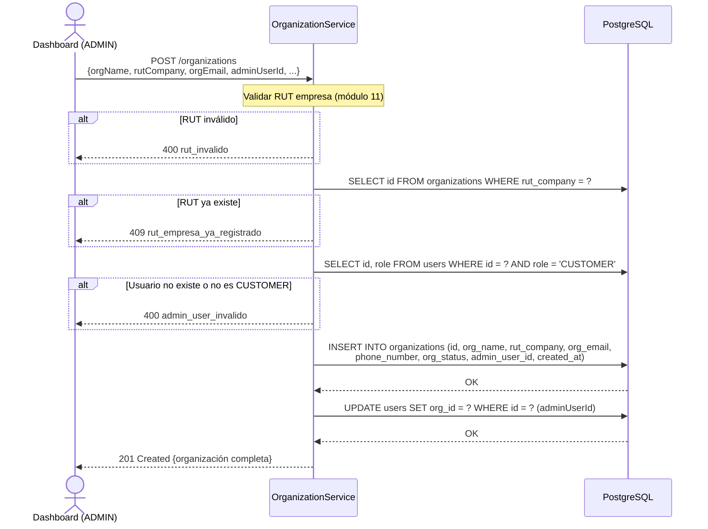
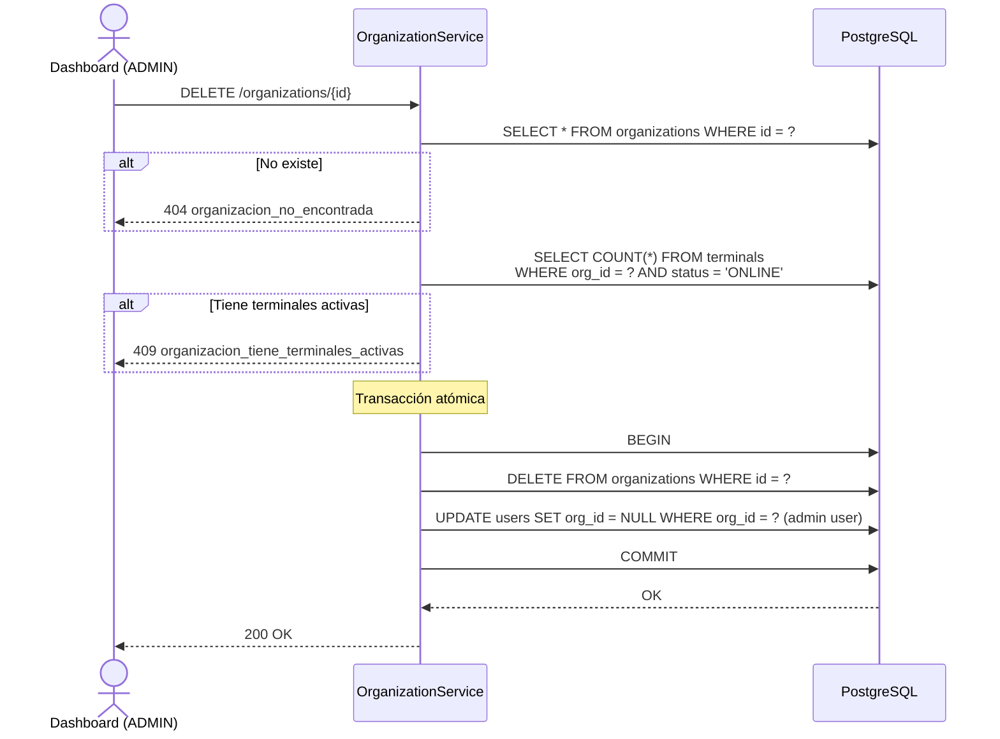
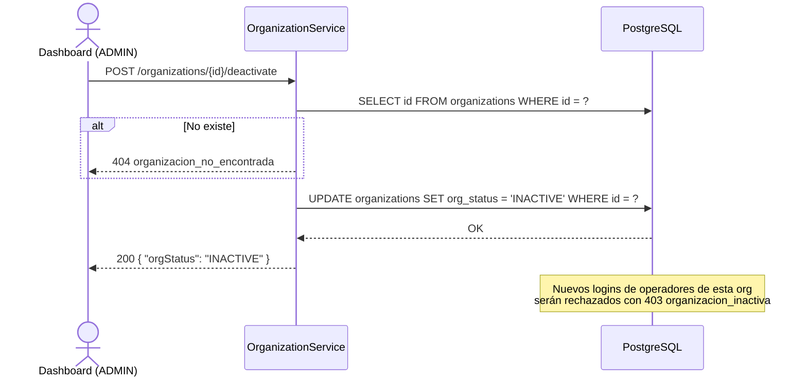

# US-006 — CRUD de Organizaciones

## Historias de Usuario

| ID | Historia |
|----|----------|
| US-006-A | **Como** ADMIN, **quiero** crear una nueva organización, **para** incorporar una empresa cliente al sistema. |
| US-006-B | **Como** ADMIN, **quiero** listar todas las organizaciones, **para** tener visibilidad del ecosistema de clientes. |
| US-006-C | **Como** ADMIN o CUSTOMER, **quiero** ver el detalle de una organización, **para** revisar su configuración. |
| US-006-D | **Como** ADMIN o CUSTOMER, **quiero** actualizar los datos de una organización, **para** mantener la información vigente. |
| US-006-E | **Como** ADMIN, **quiero** eliminar una organización, **para** retirar del sistema a una empresa que dejó de operar. |
| US-006-F | **Como** ADMIN, **quiero** activar o desactivar una organización, **para** suspender sus operaciones sin eliminarla. |

---

## Modelo de Datos

```json
{
  "id":          "uuid",
  "orgName":     "Parking Test SA",
  "rutCompany":  "76000000-0",
  "orgEmail":    "contacto@parkingtest.cl",
  "phoneNumber": "+56912345678",
  "orgStatus":   "ACTIVE",
  "adminUserId": "uuid-del-customer-admin",
  "createdAt":   "2024-01-15T10:30:00Z"
}
```

---

## Endpoints

| Método | Ruta | Rol mínimo | Descripción |
|--------|------|------------|-------------|
| `POST`   | `/organizations`              | ADMIN    | Crear organización |
| `GET`    | `/organizations`              | ADMIN    | Listar organizaciones |
| `GET`    | `/organizations/{id}`         | CUSTOMER | Ver organización (CUSTOMER solo la suya) |
| `PUT`    | `/organizations/{id}`         | CUSTOMER | Actualizar organización (CUSTOMER solo la suya) |
| `DELETE` | `/organizations/{id}`         | ADMIN    | Eliminar organización |
| `POST`   | `/organizations/{id}/activate`   | ADMIN | Activar organización |
| `POST`   | `/organizations/{id}/deactivate` | ADMIN | Desactivar organización |

---

## US-006-A — Crear Organización

### Criterios de Aceptación

| # | Criterio |
|---|----------|
| AC-1 | Solo ADMIN puede crear organizaciones. |
| AC-2 | El RUT de empresa (`rutCompany`) debe tener formato válido (módulo 11). |
| AC-3 | Si el `rutCompany` ya existe, retorna `409 Conflict` con `rut_empresa_ya_registrado`. |
| AC-4 | El campo `adminUserId` referencia a un usuario existente con rol `CUSTOMER`. Si no existe o tiene otro rol, retorna `400`. |
| AC-5 | Al crear, la organización queda en estado `ACTIVE`. |
| AC-6 | Retorna `201 Created` con el objeto completo incluyendo el UUID generado. |

### Request

```
POST /organizations
Authorization: Bearer {accessToken del ADMIN}
Content-Type: application/json

{
  "orgName":     "Parking Test SA",
  "rutCompany":  "76000000-0",
  "orgEmail":    "contacto@parkingtest.cl",
  "phoneNumber": "+56912345678",
  "adminUserId": "dddddddd-dddd-dddd-dddd-dddddddddddd"
}
```

### Response `201 Created`

```json
{
  "id":          "aaaaaaaa-aaaa-aaaa-aaaa-aaaaaaaaaaaa",
  "orgName":     "Parking Test SA",
  "rutCompany":  "76000000-0",
  "orgEmail":    "contacto@parkingtest.cl",
  "phoneNumber": "+56912345678",
  "orgStatus":   "ACTIVE",
  "adminUserId": "dddddddd-dddd-dddd-dddd-dddddddddddd",
  "createdAt":   "2024-01-15T10:30:00Z"
}
```

### Diagrama de Secuencia



### Errores

| HTTP | Código | Causa |
|------|--------|-------|
| 400  | `rut_invalido` | RUT de empresa con formato incorrecto |
| 400  | `admin_user_invalido` | `adminUserId` no existe o no tiene rol CUSTOMER |
| 403  | — | El caller no es ADMIN |
| 409  | `rut_empresa_ya_registrado` | El RUT de empresa ya pertenece a otra organización |

---

## US-006-B — Listar Organizaciones

### Criterios de Aceptación

| # | Criterio |
|---|----------|
| AC-1 | Solo ADMIN puede listar todas las organizaciones. |
| AC-2 | CUSTOMER y OPERATOR no pueden listar — retorna `403 Forbidden`. |
| AC-3 | Retorna lista vacía `[]` si no hay organizaciones. |
| AC-4 | La lista incluye organizaciones en cualquier estado (`ACTIVE`, `INACTIVE`). |

### Request

```
GET /organizations
Authorization: Bearer {accessToken del ADMIN}
```

### Response `200 OK`

```json
[
  {
    "id":          "aaaaaaaa-aaaa-aaaa-aaaa-aaaaaaaaaaaa",
    "orgName":     "Parking Test SA",
    "rutCompany":  "76000000-0",
    "orgEmail":    "contacto@parkingtest.cl",
    "orgStatus":   "ACTIVE",
    "adminUserId": "dddddddd-dddd-dddd-dddd-dddddddddddd",
    "createdAt":   "2024-01-15T10:30:00Z"
  }
]
```

---

## US-006-C — Obtener Organización

### Criterios de Aceptación

| # | Criterio |
|---|----------|
| AC-1 | ADMIN puede ver cualquier organización. |
| AC-2 | CUSTOMER solo puede ver su propia organización. Si intenta ver otra, retorna `403 Forbidden`. |
| AC-3 | OPERATOR no tiene acceso — retorna `403 Forbidden`. |
| AC-4 | Si el ID no existe, retorna `404 Not Found` con `organizacion_no_encontrada`. |

### Request

```
GET /organizations/{id}
Authorization: Bearer {accessToken}
```

### Response `200 OK`

Objeto completo de la organización (mismo formato que creación).

### Errores

| HTTP | Código | Causa |
|------|--------|-------|
| 403  | — | CUSTOMER intentó ver otra org / OPERATOR intentó ver cualquiera |
| 404  | `organizacion_no_encontrada` | El ID no existe |

---

## US-006-D — Actualizar Organización

### Criterios de Aceptación

| # | Criterio |
|---|----------|
| AC-1 | ADMIN puede actualizar cualquier organización. |
| AC-2 | CUSTOMER solo puede actualizar su propia organización. |
| AC-3 | Campos actualizables: `orgName`, `rutCompany`, `orgEmail`, `phoneNumber`. El `adminUserId` y `orgStatus` no son modificables por este endpoint. |
| AC-4 | Si el body no contiene ningún campo válido, retorna `400` con `sin_campos_para_actualizar`. |
| AC-5 | Si el ID no existe, retorna `404`. |

### Request

```
PUT /organizations/{id}
Authorization: Bearer {accessToken}
Content-Type: application/json

{
  "orgName":     "Parking Test SA (actualizado)",
  "phoneNumber": "+56911111111"
}
```

### Response `200 OK`

```json
{ "message": "organizacion_actualizada" }
```

### Errores

| HTTP | Código | Causa |
|------|--------|-------|
| 400  | `sin_campos_para_actualizar` | Body sin campos válidos |
| 403  | — | CUSTOMER intentó actualizar otra org |
| 404  | `organizacion_no_encontrada` | El ID no existe |

---

## US-006-E — Eliminar Organización

### Criterios de Aceptación

| # | Criterio |
|---|----------|
| AC-1 | Solo ADMIN puede eliminar organizaciones. |
| AC-2 | La eliminación es transaccional: metadata de la organización + vínculo con el usuario admin en una sola operación atómica. |
| AC-3 | Los usuarios de la organización **no se eliminan automáticamente** — quedan huérfanos con `org_id` referenciando una org inexistente. El ADMIN debe eliminarlos manualmente antes o después. |
| AC-4 | Si el ID no existe, retorna `404`. |
| AC-5 | No se puede eliminar una organización con terminales activas (`status = ONLINE`). Retorna `409 Conflict` con `organizacion_tiene_terminales_activas`. |

### Request

```
DELETE /organizations/{id}
Authorization: Bearer {accessToken del ADMIN}
```

### Response `200 OK`

Sin body.

### Diagrama de Secuencia



### Errores

| HTTP | Código | Causa |
|------|--------|-------|
| 403  | — | El caller no es ADMIN |
| 404  | `organizacion_no_encontrada` | El ID no existe |
| 409  | `organizacion_tiene_terminales_activas` | Hay terminales ONLINE en esa org |

---

## US-006-F — Activar / Desactivar Organización

### Criterios de Aceptación

| # | Criterio |
|---|----------|
| AC-1 | Solo ADMIN puede cambiar el estado de una organización. |
| AC-2 | Al desactivar una organización, sus operadores con sesión activa deben seguir pudiendo completar sus operaciones en curso. El bloqueo aplica a **nuevos** logins. |
| AC-3 | El login de un operador cuya organización está `INACTIVE` retorna `403` con `organizacion_inactiva`. |
| AC-4 | Si el ID no existe, retorna `404`. |

### Requests

```
POST /organizations/{id}/activate
POST /organizations/{id}/deactivate
Authorization: Bearer {accessToken del ADMIN}
```

Sin body.

### Response `200 OK`

```json
{ "orgStatus": "INACTIVE" }
```

### Diagrama de Secuencia



### Errores

| HTTP | Código | Causa |
|------|--------|-------|
| 403  | — | El caller no es ADMIN |
| 404  | `organizacion_no_encontrada` | El ID no existe |

---

## Reglas de Aislamiento de Datos

| Operación | ADMIN | CUSTOMER | OPERATOR |
|-----------|-------|----------|----------|
| Crear | ✓ | ✗ | ✗ |
| Listar | Todas | ✗ | ✗ |
| Ver | Cualquiera | Solo la propia | ✗ |
| Actualizar | Cualquiera | Solo la propia | ✗ |
| Eliminar | Cualquiera | ✗ | ✗ |
| Activar/Desactivar | Cualquiera | ✗ | ✗ |

---

## Archivos Relacionados

| Archivo | Rol |
|---------|-----|
| `organization/OrganizationController.java` | Controlador REST — todos los endpoints de organización |
| `organization/OrganizationService.java` | Lógica de negocio — aislamiento por rol, validación de RUT empresa |
| `organization/OrganizationRepository.java` | `insert`, `findById`, `findAll`, `update`, `delete`, `setStatus` |
| `organization/Organization.java` | Record del modelo de dominio |
| `organization/CreateOrganizationRequest.java` | Record del body de creación |
| `organization/UpdateOrganizationRequest.java` | Record del body de actualización |
| `shared/rut/RutUtils.java` | Validación del RUT empresa |
| `config/SecurityConfig.java` | Roles RBAC — `@PreAuthorize` por endpoint |
| `docker/init/02_seed.sql` | Organización de prueba: `Parking Test SA` (RUT `76000000-0`) |
