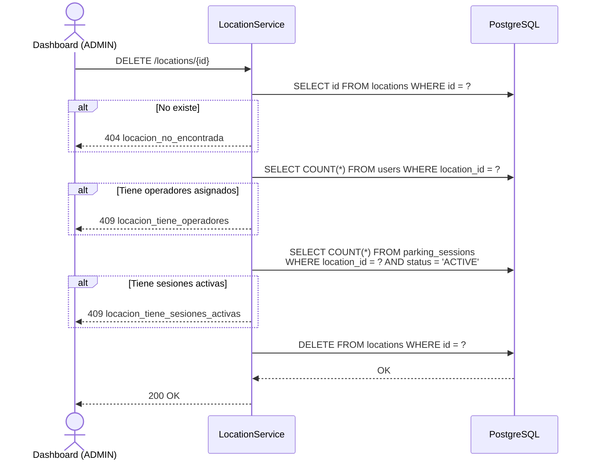

# US-007 — CRUD de Locaciones

## Historias de Usuario

| ID | Historia |
|----|----------|
| US-007-A | **Como** ADMIN, **quiero** crear una locación dentro de una organización, **para** definir los puntos físicos de estacionamiento y opcionalmente limitar cuántos OPERATORs pueden trabajar en ella. |
| US-007-B | **Como** ADMIN o CUSTOMER, **quiero** listar las locaciones, **para** tener visibilidad de los puntos bajo mi gestión. |
| US-007-C | **Como** cualquier usuario autenticado, **quiero** ver el detalle de una locación, **para** conocer su configuración y el estado de cupo de operadores. |
| US-007-D | **Como** ADMIN o CUSTOMER, **quiero** actualizar los datos de una locación, **para** corregir información o ajustar el cupo de operadores. |
| US-007-E | **Como** ADMIN, **quiero** eliminar una locación, **para** retirarla del sistema cuando ya no opere. |
| US-007-F | **Como** ADMIN o CUSTOMER, **quiero** activar o desactivar una locación, **para** suspender operaciones en un punto sin eliminarlo. |

---

## Modelo de Datos

```json
{
  "id":                   "uuid",
  "orgId":                "uuid-org",
  "locationName":         "Sucursal Centro",
  "address":              "Av. Bernardo O'Higgins 1234",
  "city":                 "Santiago",
  "timezone":             "America/Santiago",
  "capacity":             150,
  "maxOperators":         5,
  "activeOperatorsCount": 3,
  "locationStatus":       "ACTIVE",
  "createdAt":            "2024-01-15T10:30:00Z"
}
```

> `timezone` es crítica: turnos, ingresos y egresos de vehículos se interpretan en la zona horaria de la locación.
> `capacity` es el número de puestos físicos de estacionamiento.
> `maxOperators` es el techo de usuarios con rol OPERATOR que pueden ser asignados a esta locación. El valor `0` significa **sin restricción**. Si no se envía al crear, el sistema usa `0` por defecto.
> `activeOperatorsCount` es un campo **computado** (solo lectura): COUNT de usuarios con `role = 'OPERATOR'`, `user_status = 'ACTIVE'` y `location_id` apuntando a esta locación.
>
> **Nota de acceso**: el rol OPERATOR accede a la información de locaciones **exclusivamente** a través de `GET /pos/bootstrap/{serialNumber}`. No tiene acceso a los endpoints REST de este CRUD. La información de locación que recibe proviene de su propio `location_id` asignado como usuario, no del terminal.

---

## Endpoints

| Método | Ruta | Rol mínimo | Descripción |
|--------|------|------------|-------------|
| `POST`   | `/locations`                    | ADMIN    | Crear locación |
| `GET`    | `/locations?orgId=`             | CUSTOMER | Listar locaciones (web dashboard) |
| `GET`    | `/locations/{id}`               | CUSTOMER | Ver locación (web dashboard) |
| `PUT`    | `/locations/{id}`               | CUSTOMER | Actualizar locación |
| `DELETE` | `/locations/{id}`               | ADMIN    | Eliminar locación |
| `POST`   | `/locations/{id}/activate`      | CUSTOMER | Activar locación |
| `POST`   | `/locations/{id}/deactivate`    | CUSTOMER | Desactivar locación |

---

## US-007-A — Crear Locación

### Criterios de Aceptación

| # | Criterio |
|---|----------|
| AC-1 | Solo ADMIN puede crear locaciones. |
| AC-2 | `locationName`, `address`, `city` y `orgId` son obligatorios. |
| AC-3 | Si `timezone` no se envía, se usa `America/Santiago` por defecto. |
| AC-4 | `capacity` (número de puestos físicos) es obligatorio y debe ser `>= 1`. |
| AC-5 | `maxOperators` es opcional. Si no se envía, se usa `0` (sin límite). Si se envía, debe ser `>= 0`. |
| AC-6 | La locación se crea en estado `ACTIVE`. |
| AC-7 | Retorna `201 Created` con el objeto completo incluyendo `activeOperatorsCount: 0`. |

### Request

```
POST /locations
Authorization: Bearer {accessToken}
Content-Type: application/json

{
  "orgId":        "aaaaaaaa-aaaa-aaaa-aaaa-aaaaaaaaaaaa",
  "locationName": "Sucursal Centro",
  "address":      "Av. Bernardo O'Higgins 1234",
  "city":         "Santiago",
  "timezone":     "America/Santiago",
  "capacity":     150,
  "maxOperators": 5
}
```

### Response `201 Created`

```json
{
  "id":                   "cccccccc-cccc-cccc-cccc-cccccccccccc",
  "orgId":                "aaaaaaaa-aaaa-aaaa-aaaa-aaaaaaaaaaaa",
  "locationName":         "Sucursal Centro",
  "address":              "Av. Bernardo O'Higgins 1234",
  "city":                 "Santiago",
  "timezone":             "America/Santiago",
  "capacity":             150,
  "maxOperators":         5,
  "activeOperatorsCount": 0,
  "locationStatus":       "ACTIVE",
  "createdAt":            "2024-01-15T10:30:00Z"
}
```

### Errores

| HTTP | Código | Causa |
|------|--------|-------|
| 400  | `campos_requeridos_faltantes` | Falta `orgId`, `locationName`, `address`, `city` o `capacity` |
| 400  | `capacity_invalido` | `capacity` es menor a `1` |
| 400  | `max_operators_invalido` | `maxOperators` es menor a `0` |
| 404  | `organizacion_no_encontrada` | El `orgId` no existe |

---

## US-007-B — Listar Locaciones

### Criterios de Aceptación

| # | Criterio |
|---|----------|
| AC-1 | ADMIN sin filtro retorna todas las locaciones. Con `?orgId=` filtra por organización. |
| AC-2 | CUSTOMER debe pasar `?orgId=` de su propia organización. Si pasa otra, retorna `403`. |
| AC-3 | Retorna `200 OK` con lista vacía si no hay locaciones. |

### Request

```
GET /locations?orgId=aaaaaaaa-aaaa-aaaa-aaaa-aaaaaaaaaaaa
Authorization: Bearer {accessToken}
```

### Response `200 OK`

```json
[
  {
    "id":                   "cccccccc-cccc-cccc-cccc-cccccccccccc",
    "orgId":                "aaaaaaaa-aaaa-aaaa-aaaa-aaaaaaaaaaaa",
    "locationName":         "Sucursal Centro",
    "city":                 "Santiago",
    "locationStatus":       "ACTIVE",
    "timezone":             "America/Santiago",
    "maxOperators":         5,
    "activeOperatorsCount": 3
  }
]
```

---

## US-007-C — Obtener Locación

### Criterios de Aceptación

| # | Criterio |
|---|----------|
| AC-1 | ADMIN puede ver cualquier locación. |
| AC-2 | CUSTOMER puede ver solo locaciones de su organización. |
| AC-3 | Si el ID no existe, retorna `404` con `locacion_no_encontrada`. |
| AC-4 | La respuesta incluye `maxOperators` y `activeOperatorsCount` calculado en el momento de la consulta. |

---

## US-007-D — Actualizar Locación

### Criterios de Aceptación

| # | Criterio |
|---|----------|
| AC-1 | ADMIN puede actualizar cualquier locación. |
| AC-2 | CUSTOMER puede actualizar solo locaciones de su organización. |
| AC-3 | Campos actualizables: `locationName`, `address`, `city`, `timezone`, `capacity`, `maxOperators`. |
| AC-4 | `capacity` debe ser `>= 1` si se envía. |
| AC-5 | `maxOperators` debe ser `>= 0` si se envía. El valor `0` elimina la restricción. |
| AC-6 | Si se envía `maxOperators > 0` y el nuevo valor es menor que `activeOperatorsCount`, retorna `409` con `max_operators_inferior_a_activos`. |
| AC-7 | `orgId` no se puede modificar (pertenencia de la locación es inmutable). |
| AC-8 | Si el body está vacío, retorna `400` con `sin_campos_para_actualizar`. |

### Request

```
PUT /locations/{id}
Authorization: Bearer {accessToken}
Content-Type: application/json

{
  "locationName": "Sucursal Centro (Piso 2)",
  "timezone":     "America/Santiago",
  "capacity":     200,
  "maxOperators": 8
}
```

### Response `200 OK`

Retorna el objeto completo con los cambios aplicados, incluyendo `activeOperatorsCount` actualizado.

### Errores

| HTTP | Código | Causa |
|------|--------|-------|
| 409  | `max_operators_inferior_a_activos` | El nuevo `maxOperators` es menor que el número de operadores activos actualmente asignados |

---

## US-007-E — Eliminar Locación

### Criterios de Aceptación

| # | Criterio |
|---|----------|
| AC-1 | Solo ADMIN puede eliminar locaciones. |
| AC-2 | No se puede eliminar si tiene operadores asignados (cualquier estado de usuario). Retorna `409` con `locacion_tiene_operadores`. El ADMIN debe reasignar o desactivar los operadores primero. |
| AC-3 | No se puede eliminar si tiene sesiones de estacionamiento activas (`ACTIVE`). Retorna `409` con `locacion_tiene_sesiones_activas`. |
| AC-4 | Si el ID no existe, retorna `404`. |

### Diagrama de Secuencia



---

## US-007-F — Activar / Desactivar Locación

### Criterios de Aceptación

| # | Criterio |
|---|----------|
| AC-1 | ADMIN o CUSTOMER (propia org) pueden cambiar el estado. |
| AC-2 | Al desactivar, los turnos y sesiones activas en esa locación continúan hasta su cierre natural. El bloqueo aplica a **nuevas** operaciones. |
| AC-3 | Si se intenta abrir un turno en una locación `INACTIVE`, retorna `403` con `locacion_inactiva`. |

### Response `200 OK`

```json
{ "locationStatus": "INACTIVE" }
```

---

## Reglas de Aislamiento

| Operación | ADMIN | CUSTOMER | OPERATOR |
|-----------|-------|----------|----------|
| Crear | Cualquier org | ✗ | ✗ |
| Listar | Todas / por org | Solo su org | vía bootstrap |
| Ver | Cualquiera | Solo su org | vía bootstrap |
| Actualizar | Cualquiera | Solo su org | ✗ |
| Eliminar | Cualquiera | ✗ | ✗ |
| Activar/Desactivar | Cualquiera | Solo su org | ✗ |

> "vía bootstrap" significa que el OPERATOR recibe esta información en `GET /pos/bootstrap/{serialNumber}`, extraída de su propio `location_id` de usuario, no del terminal.

---

## Regla de Dominio — Cupo de Operadores por Locación

### Responsabilidades por Rol

| Quién | Qué hace |
|-------|----------|
| **ADMIN** | Define `maxOperators` al crear o actualizar la locación. Establece el techo de OPERATORs que el cliente puede tener en esa locación. |
| **CUSTOMER** | Dentro del cupo asignado, crea y gestiona sus propios usuarios OPERATOR (`POST /users`, `PUT /users/{id}`). No puede eliminar usuarios. |
| **ADMIN** | Es el único que puede eliminar usuarios (`DELETE /users/{id}`). |

### Reglas de Cupo

| Regla | Detalle |
|-------|---------|
| **Sin restricción por defecto** | `maxOperators = 0` significa cupo ilimitado. Es el valor por defecto al crear una locación. |
| **Cupo definido por ADMIN** | El ADMIN puede establecer `maxOperators >= 1` al crear o actualizar la locación para imponer un techo. |
| **Conteo en tiempo real** | `activeOperatorsCount` = COUNT de `users` con `role = 'OPERATOR'`, `user_status = 'ACTIVE'` y `location_id` = esta locación. Se devuelve en cada `GET`. |
| **Validación al asignar operador** | Al crear un OPERATOR (`POST /users`) o reasignarle locación (`PUT /users/{id}`), si `maxOperators > 0`, el sistema verifica que `activeOperatorsCount < maxOperators`. Si el cupo está lleno, retorna `409` con `cupo_operadores_agotado`. |
| **Reducción de cupo** | Si se reduce `maxOperators` a un valor `> 0` pero inferior a `activeOperatorsCount`, retorna `409` con `max_operators_inferior_a_activos`. |
| **Garantía de BD** | La constraint `chk_operator_has_location` en la tabla `users` garantiza que todo OPERATOR tenga siempre un `location_id` asignado. |

> Ver [US-005](US-005-crud-usuarios.md) — US-005-H para los criterios de aceptación de la creación de usuarios por parte del CUSTOMER.

---

## Archivos Relacionados

| Archivo | Rol |
|---------|-----|
| `location/LocationController.java` | REST endpoints |
| `location/LocationService.java` | RBAC + validaciones de cupo y eliminación |
| `location/LocationRepository.java` | `findById`, `findByOrgId`, `findAll`, `insert`, `update`, `delete`, `setStatus`, `countActiveOperators`, `hasActiveParkingSessions`, `hasAssignedOperators` |
| `location/Location.java` | Record de dominio |
| `location/CreateLocationRequest.java` | Body de creación |
| `location/UpdateLocationRequest.java` | Body de actualización |
