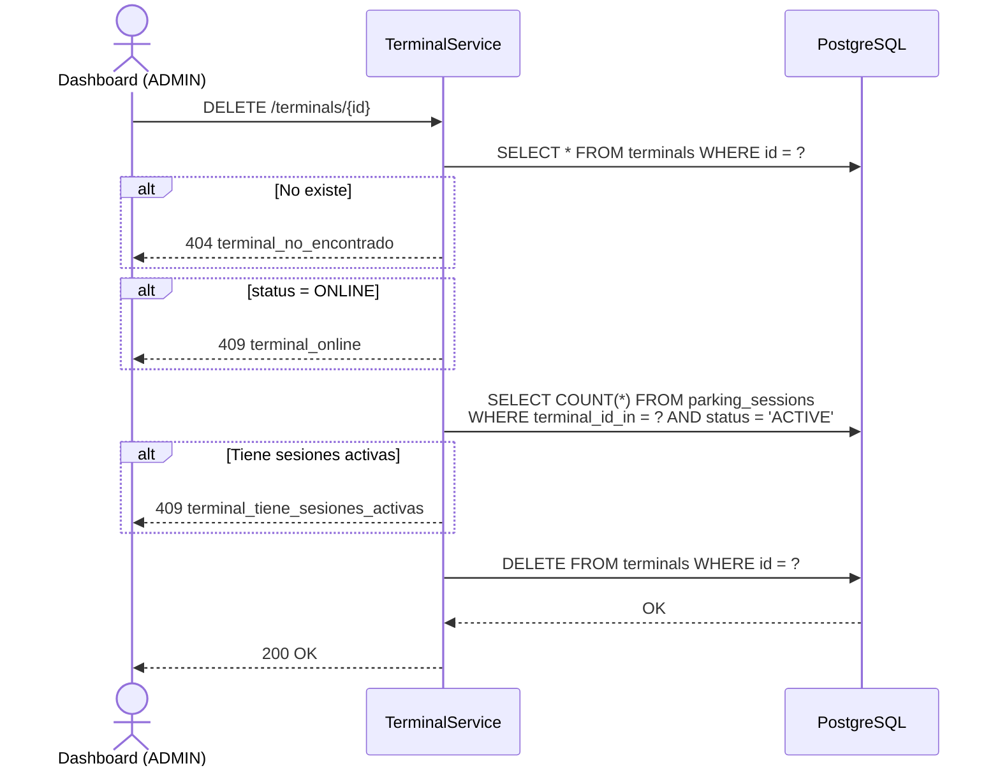
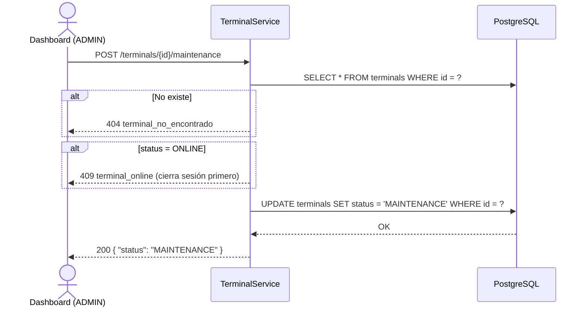

# US-008 — CRUD de Terminales

## Historias de Usuario

| ID | Historia |
|----|----------|
| US-008-A | **Como** ADMIN, **quiero** registrar un terminal POS, **para** asociarlo a una locación y habilitarlo para el login de operadores. |
| US-008-B | **Como** ADMIN o CUSTOMER, **quiero** listar los terminales, **para** conocer el estado de cada dispositivo en mis locaciones. |
| US-008-C | **Como** ADMIN o CUSTOMER, **quiero** ver el detalle de un terminal, **para** conocer su estado, operador activo y versión de app. |
| US-008-D | **Como** ADMIN, **quiero** actualizar los datos de un terminal, **para** corregir su modelo o moverlo a otra locación. |
| US-008-E | **Como** ADMIN, **quiero** eliminar un terminal, **para** darlo de baja del inventario. |
| US-008-F | **Como** ADMIN, **quiero** poner un terminal en mantenimiento o sacarlo, **para** bloquearlo temporalmente sin eliminarlo. |

---

## Modelo de Datos

```json
{
  "id":               "uuid",
  "serialNumber":     "TUU-2024-001",
  "model":            "TUU Pro",
  "orgId":            "uuid-org",
  "locationId":       "uuid-location",
  "status":           "OFFLINE",
  "activeOperatorId": null,
  "appVersion":       "2.3.1",
  "lastHeartbeat":    "2024-01-15T10:29:00Z"
}
```

### Ciclo de Vida del Estado (`terminal_status`)

```
OFFLINE ──[operator login]──► ONLINE
ONLINE  ──[operator logout / shift close]──► OFFLINE
OFFLINE ──[manual]──► MAINTENANCE
MAINTENANCE ──[manual]──► OFFLINE
ONLINE  no puede ir directo a MAINTENANCE (debe cerrarse la sesión primero)
```

| Estado | Logins permitidos | Descripción |
|--------|:-----------------:|-------------|
| `OFFLINE`      | ✓ | Disponible para login de operador |
| `ONLINE`       | ✗ | Tiene un operador activo |
| `MAINTENANCE`  | ✗ | Bloqueado para mantenimiento técnico |

---

## Endpoints

| Método | Ruta | Rol mínimo | Descripción |
|--------|------|------------|-------------|
| `POST`   | `/terminals`                      | ADMIN    | Registrar terminal |
| `GET`    | `/terminals?orgId=&locationId=`   | CUSTOMER | Listar terminales (web dashboard) |
| `GET`    | `/terminals/{id}`                 | CUSTOMER | Ver terminal (web dashboard) |
| `PUT`    | `/terminals/{id}`                 | ADMIN    | Actualizar terminal |
| `DELETE` | `/terminals/{id}`                 | ADMIN    | Eliminar terminal |
| `POST`   | `/terminals/{id}/maintenance`     | ADMIN    | Poner en mantenimiento |
| `POST`   | `/terminals/{id}/offline`         | ADMIN    | Sacar de mantenimiento (→ OFFLINE) |

> **Nota de acceso**: el rol OPERATOR accede a la información del terminal **exclusivamente** a través de `GET /pos/bootstrap/{serialNumber}`. No tiene acceso a estos endpoints REST.

---

## US-008-A — Registrar Terminal

### Criterios de Aceptación

| # | Criterio |
|---|----------|
| AC-1 | Solo ADMIN puede registrar terminales. |
| AC-2 | `serialNumber`, `model`, `orgId` y `locationId` son obligatorios. |
| AC-3 | El `serialNumber` debe ser único en todo el sistema. Si ya existe, retorna `409` con `serial_number_ya_registrado`. |
| AC-4 | El `serialNumber` es la identidad física del dispositivo: una vez registrado, no puede modificarse. |
| AC-5 | La locación referenciada debe pertenecer a la misma organización que el terminal. Si no, retorna `400` con `location_no_pertenece_a_org`. |
| AC-6 | El terminal se registra con estado `OFFLINE`. |
| AC-7 | Retorna `201 Created` con el objeto completo. |

### Request

```
POST /terminals
Authorization: Bearer {accessToken}
Content-Type: application/json

{
  "serialNumber": "TUU-2024-001",
  "model":        "TUU Pro",
  "orgId":        "aaaaaaaa-aaaa-aaaa-aaaa-aaaaaaaaaaaa",
  "locationId":   "cccccccc-cccc-cccc-cccc-cccccccccccc",
  "appVersion":   "2.3.1"
}
```

### Response `201 Created`

```json
{
  "id":               "dddddddd-dddd-dddd-dddd-dddddddddddd",
  "serialNumber":     "TUU-2024-001",
  "model":            "TUU Pro",
  "orgId":            "aaaaaaaa-aaaa-aaaa-aaaa-aaaaaaaaaaaa",
  "locationId":       "cccccccc-cccc-cccc-cccc-cccccccccccc",
  "status":           "OFFLINE",
  "activeOperatorId": null,
  "appVersion":       "2.3.1",
  "lastHeartbeat":    null
}
```

### Errores

| HTTP | Código | Causa |
|------|--------|-------|
| 400  | `campos_requeridos_faltantes` | Falta `serialNumber`, `model`, `orgId` o `locationId` |
| 400  | `location_no_pertenece_a_org` | La locación no pertenece a la org indicada |
| 409  | `serial_number_ya_registrado` | `serialNumber` duplicado en el sistema |

---

## US-008-B — Listar Terminales

### Criterios de Aceptación

| # | Criterio |
|---|----------|
| AC-1 | ADMIN sin filtros retorna todos. Con `?orgId=` o `?locationId=` filtra. |
| AC-2 | CUSTOMER debe filtrar por su `orgId` o una `locationId` de su org. |
| AC-3 | Retorna `200 OK` con lista vacía si no hay terminales. |

---

## US-008-C — Obtener Terminal

### Criterios de Aceptación

| # | Criterio |
|---|----------|
| AC-1 | ADMIN: cualquier terminal. CUSTOMER: solo de su org. |
| AC-2 | Si el ID no existe, retorna `404` con `terminal_no_encontrado`. |

---

## US-008-D — Actualizar Terminal

### Criterios de Aceptación

| # | Criterio |
|---|----------|
| AC-1 | Solo ADMIN puede actualizar terminales. |
| AC-2 | Campos actualizables: `model`, `locationId`, `appVersion`. El `serialNumber` y `orgId` son inmutables. |
| AC-3 | Si se cambia `locationId`, la nueva locación debe pertenecer a la misma organización. |
| AC-4 | No se puede reasignar la locación si el terminal está `ONLINE` (tiene operador activo). Retorna `409` con `terminal_online_no_reasignable`. |

### Errores

| HTTP | Código | Causa |
|------|--------|-------|
| 400  | `location_no_pertenece_a_org` | Nueva locación no pertenece a la org del terminal |
| 409  | `terminal_online_no_reasignable` | No se puede cambiar locación con terminal ONLINE |

---

## US-008-E — Eliminar Terminal

### Criterios de Aceptación

| # | Criterio |
|---|----------|
| AC-1 | Solo ADMIN puede eliminar terminales. |
| AC-2 | No se puede eliminar si está `ONLINE` (tiene operador activo). Retorna `409` con `terminal_online`. |
| AC-3 | No se puede eliminar si tiene sesiones de estacionamiento activas. Retorna `409` con `terminal_tiene_sesiones_activas`. |
| AC-4 | Si el ID no existe, retorna `404`. |

### Diagrama de Secuencia



---

## US-008-F — Mantenimiento y Recuperación

### Criterios de Aceptación

| # | Criterio |
|---|----------|
| AC-1 | Solo ADMIN puede cambiar el estado a `MAINTENANCE` o `OFFLINE`. |
| AC-2 | Solo un terminal en estado `OFFLINE` puede pasar a `MAINTENANCE`. Si está `ONLINE`, retorna `409` con `terminal_online`. |
| AC-3 | Un terminal en `MAINTENANCE` puede volver a `OFFLINE` vía `POST /terminals/{id}/offline`. |
| AC-4 | `MAINTENANCE` bloquea el login de cualquier operador en ese terminal. En `deviceLogin`, si el terminal está en `MAINTENANCE`, retorna `403` con `terminal_en_mantenimiento`. |

### Diagrama de Secuencia — Poner en Mantenimiento



---

## Relación con Auth Flow

El estado del terminal es validado en `POST /auth/device` (US-001):
- `ONLINE` → bloquea nuevo login (`terminal_no_disponible`)
- `MAINTENANCE` → bloquea nuevo login (`terminal_en_mantenimiento`)
- `OFFLINE` → permite login

Cuando el operador hace login exitoso:
1. Terminal → `ONLINE`
2. `active_operator_id` = `user.id`

Cuando el operador hace logout:
1. Terminal → `OFFLINE`
2. `active_operator_id` = `NULL`

---

## Reglas de Aislamiento

| Operación | ADMIN | CUSTOMER | OPERATOR |
|-----------|-------|----------|----------|
| Registrar | Cualquier org | ✗ | ✗ |
| Listar | Todos / filtrar | Solo su org | vía bootstrap |
| Ver | Cualquiera | Solo su org | vía bootstrap |
| Actualizar | Cualquiera | ✗ | ✗ |
| Eliminar | Cualquiera | ✗ | ✗ |
| Mantenimiento / Offline | Cualquiera | ✗ | ✗ |

---

## Archivos Relacionados

| Archivo | Rol |
|---------|-----|
| `terminal/TerminalController.java` | REST endpoints |
| `terminal/TerminalService.java` | RBAC + validaciones de estado |
| `terminal/TerminalRepository.java` | Extender stub existente: `findById`, `findByOrgId`, `findByLocationId`, `insert`, `update`, `delete`, `setStatus`, `setActiveOperator` |
| `terminal/Terminal.java` | Record de dominio (ya existe) |
| `terminal/CreateTerminalRequest.java` | Body de creación |
| `terminal/UpdateTerminalRequest.java` | Body de actualización |
| `auth/AuthService.java` | Agregar check `MAINTENANCE` en `deviceLogin` |
