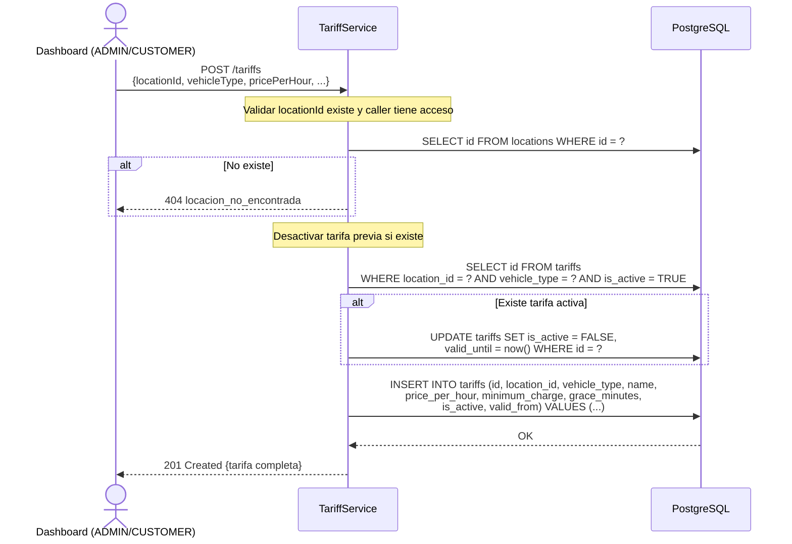

# US-009 — Gestión de Tarifas

## Historias de Usuario

| ID | Historia |
|----|----------|
| US-009-A | **Como** ADMIN o CUSTOMER, **quiero** crear una tarifa para un tipo de vehículo en una locación, **para** definir el precio de estacionamiento. |
| US-009-B | **Como** cualquier usuario autenticado, **quiero** consultar las tarifas vigentes de una locación, **para** informar al cliente cuánto pagará. |
| US-009-C | **Como** ADMIN o CUSTOMER, **quiero** desactivar una tarifa, **para** reemplazarla por una nueva sin perder el historial de precios. |

---

## Modelo de Datos

```json
{
  "id":           "uuid",
  "locationId":   "uuid-location",
  "vehicleType":  "CAR",
  "name":         "Tarifa Día",
  "pricePerHour": 1500.00,
  "minimumCharge": 500.00,
  "graceMinutes": 10,
  "isActive":     true,
  "validFrom":    "2024-01-15T10:30:00Z",
  "validUntil":   null
}
```

### Reglas de Negocio Clave

- **Inmutabilidad**: las tarifas **no se actualizan** (`PUT` no existe). Para cambiar el precio se crea una nueva tarifa; el sistema desactiva automáticamente la anterior.
- **Unicidad activa**: solo puede existir **una tarifa activa** por combinación `(locationId, vehicleType)`. Garantizado por índice parcial único en PostgreSQL.
- **Historial**: las tarifas desactivadas persisten para que las transacciones pasadas mantengan su precio referenciado.
- **`graceMinutes`**: minutos iniciales sin cobro. Ej: 10 minutos gratis → una estadía de 8 minutos no genera cargo.
- **`minimumCharge`**: cargo mínimo si la estadía supera la gracia. Ej: `pricePerHour=1500`, `minimumCharge=500` → una estadía de 5 min cobra 500 (no 125).

### Tipos de Vehículo (`vehicle_type`)

| Tipo | Descripción |
|------|-------------|
| `CAR` | Automóvil / sedán |
| `MOTORCYCLE` | Moto / scooter |
| `PICKUP` | Camioneta / SUV |
| `BUS` | Bus / van |

---

## Endpoints

| Método | Ruta | Rol mínimo | Descripción |
|--------|------|------------|-------------|
| `POST`   | `/tariffs`                      | CUSTOMER | Crear tarifa |
| `GET`    | `/tariffs?locationId=&vehicleType=&active=` | CUSTOMER | Listar tarifas (web dashboard) |
| `GET`    | `/tariffs/{id}`                 | CUSTOMER | Ver tarifa específica (web dashboard) |
| `POST`   | `/tariffs/{id}/deactivate`      | CUSTOMER | Desactivar tarifa |

> **Nota de acceso**: el OPERATOR recibe las tarifas activas de su locación exclusivamente vía `GET /pos/bootstrap/{serialNumber}`. El precio queda congelado como `tariff_snapshot` en cada sesión de estacionamiento al momento del ingreso.

---

## US-009-A — Crear Tarifa

### Criterios de Aceptación

| # | Criterio |
|---|----------|
| AC-1 | ADMIN puede crear tarifas en cualquier locación. |
| AC-2 | CUSTOMER puede crear tarifas solo en locaciones de su organización. |
| AC-3 | `locationId`, `vehicleType` y `pricePerHour` son obligatorios. `pricePerHour >= 0`. |
| AC-4 | Si ya existe una tarifa activa para el mismo `(locationId, vehicleType)`, se desactiva automáticamente (`is_active = false`, `valid_until = now()`) antes de crear la nueva. |
| AC-5 | `minimumCharge` por defecto es `0`. `graceMinutes` por defecto es `0`. |
| AC-6 | La nueva tarifa queda con `is_active = true` y `valid_from = now()`. |
| AC-7 | Retorna `201 Created` con el objeto de la tarifa creada. |

### Request

```
POST /tariffs
Authorization: Bearer {accessToken}
Content-Type: application/json

{
  "locationId":    "cccccccc-cccc-cccc-cccc-cccccccccccc",
  "vehicleType":   "CAR",
  "name":          "Tarifa Día",
  "pricePerHour":  1500.00,
  "minimumCharge": 500.00,
  "graceMinutes":  10
}
```

### Response `201 Created`

```json
{
  "id":            "ffffffff-ffff-ffff-ffff-ffffffffffff",
  "locationId":    "cccccccc-cccc-cccc-cccc-cccccccccccc",
  "vehicleType":   "CAR",
  "name":          "Tarifa Día",
  "pricePerHour":  1500.00,
  "minimumCharge": 500.00,
  "graceMinutes":  10,
  "isActive":      true,
  "validFrom":     "2024-01-15T10:30:00Z",
  "validUntil":    null
}
```

### Diagrama de Secuencia



### Errores

| HTTP | Código | Causa |
|------|--------|-------|
| 400  | `campos_requeridos_faltantes` | Falta `locationId`, `vehicleType` o `pricePerHour` |
| 400  | `precio_invalido` | `pricePerHour < 0` |
| 400  | `vehicle_type_invalido` | Valor no está en `CAR, MOTORCYCLE, PICKUP, BUS` |
| 403  | `sin_permiso` | CUSTOMER intentó crear en locación de otra org |
| 404  | `locacion_no_encontrada` | El `locationId` no existe |

---

## US-009-B — Listar y Consultar Tarifas

### Criterios de Aceptación

| # | Criterio |
|---|----------|
| AC-1 | ADMIN puede listar tarifas de cualquier locación. |
| AC-2 | CUSTOMER puede listar solo tarifas de locaciones de su org. |
| AC-3 | Parámetros de filtro opcionales: `?locationId=`, `?vehicleType=`, `?active=true/false`. |
| AC-4 | Si `?active=true` (default), retorna solo tarifas vigentes. Si `?active=false`, retorna el historial completo. |
| AC-5 | Retorna `200 OK` con lista vacía si no hay tarifas. |

### Request

```
GET /tariffs?locationId=cccc...&active=true
Authorization: Bearer {accessToken}
```

### Response `200 OK`

```json
[
  {
    "id":            "ffffffff-ffff-ffff-ffff-ffffffffffff",
    "locationId":    "cccccccc-cccc-cccc-cccc-cccccccccccc",
    "vehicleType":   "CAR",
    "name":          "Tarifa Día",
    "pricePerHour":  1500.00,
    "minimumCharge": 500.00,
    "graceMinutes":  10,
    "isActive":      true,
    "validFrom":     "2024-01-15T10:30:00Z",
    "validUntil":    null
  }
]
```

---

## US-009-C — Desactivar Tarifa

### Criterios de Aceptación

| # | Criterio |
|---|----------|
| AC-1 | ADMIN puede desactivar cualquier tarifa. CUSTOMER solo las de su org. |
| AC-2 | Si la tarifa ya está inactiva, retorna `409` con `tarifa_ya_inactiva`. |
| AC-3 | La desactivación setea `is_active = false` y `valid_until = now()`. |
| AC-4 | Las sesiones de estacionamiento activas que usan esta tarifa no se ven afectadas — ya tienen el precio capturado en `tariff_snapshot` (JSONB). |
| AC-5 | Si el ID no existe, retorna `404` con `tarifa_no_encontrada`. |

### Request

```
POST /tariffs/{id}/deactivate
Authorization: Bearer {accessToken}
```

Sin body.

### Response `200 OK`

```json
{
  "id":         "ffffffff-ffff-ffff-ffff-ffffffffffff",
  "isActive":   false,
  "validUntil": "2024-06-15T14:22:00Z"
}
```

---

## Lógica de Cálculo (Referencia para US-011)

El cálculo del monto al cerrar una sesión de estacionamiento usa el snapshot de la tarifa (`tariff_snapshot` en `parking_sessions`), no la tarifa activa al momento del egreso. Esto garantiza que el precio sea el que estaba vigente al **ingreso**.

```
duration_minutes = (exit_at - entry_at) en minutos

si duration_minutes <= grace_minutes:
    amount = 0
sino:
    billable_minutes = duration_minutes - grace_minutes
    calculated = pricePerHour * (billable_minutes / 60)
    amount = max(calculated, minimumCharge)
```

Ejemplo con `pricePerHour=1500`, `minimumCharge=500`, `graceMinutes=10`:
- 8 min → 0 (dentro de gracia)
- 25 min → max(1500 × 15/60, 500) = max(375, 500) = **500**
- 90 min → max(1500 × 80/60, 500) = max(2000, 500) = **2000**

---

## Reglas de Aislamiento

| Operación | ADMIN | CUSTOMER | OPERATOR |
|-----------|-------|----------|----------|
| Crear | Cualquier locación | Solo su org | ✗ |
| Listar | Todas | Solo su org | vía bootstrap |
| Ver | Cualquiera | Solo su org | vía bootstrap |
| Desactivar | Cualquiera | Solo su org | ✗ |

---

## Archivos Relacionados

| Archivo | Rol |
|---------|-----|
| `tariff/TariffController.java` | REST endpoints |
| `tariff/TariffService.java` | RBAC + lógica de reemplazo de tarifa activa |
| `tariff/TariffRepository.java` | `insert`, `findById`, `findByLocationId`, `deactivatePrevious`, `deactivate` |
| `tariff/Tariff.java` | Record de dominio |
| `tariff/CreateTariffRequest.java` | Body de creación |
