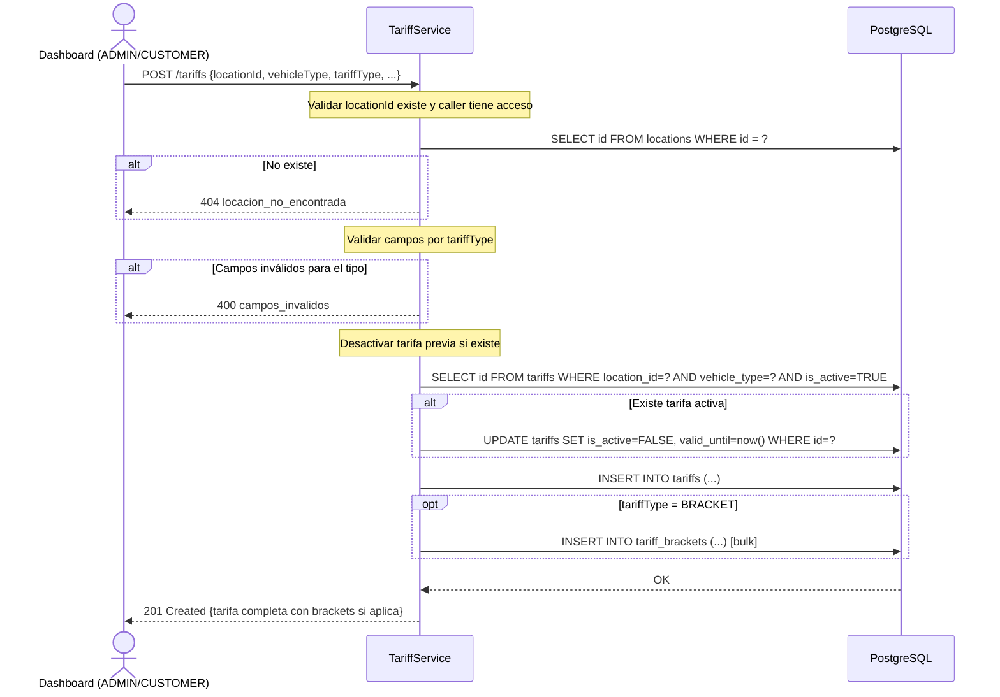

# US-009 — Gestión de Tarifas (Modelo Dinámico)

## Historias de Usuario

| ID | Historia |
|----|----------|
| US-009-A | **Como** ADMIN o CUSTOMER, **quiero** crear una tarifa de tipo PER_MINUTE, BRACKET o FLAT_ENTRY para un tipo de vehículo en una locación, **para** definir el cobro de estacionamiento según el modelo de negocio del cliente. |
| US-009-B | **Como** cualquier usuario autenticado, **quiero** consultar las tarifas vigentes de una locación, **para** informar al conductor cuánto pagará. |
| US-009-C | **Como** ADMIN o CUSTOMER, **quiero** desactivar una tarifa, **para** reemplazarla por una nueva sin perder el historial de precios. |

---

## Tipos de Tarifa

Las tres modalidades son **mutuamente excluyentes** por combinación `(locationId, vehicleType)`. Al activar una, las otras quedan inactivas. El campo `tariffType` discrimina el tipo.

### 1. PER_MINUTE — Por minuto con tope máximo

Cobra un monto por cada minuto transcurrido. Tiene un período de gracia inicial sin cobro y un tope máximo que congela el cobro cuando se alcanza.

| Campo | Tipo | Requerido | Descripción |
|-------|------|-----------|-------------|
| `pricePerMinute` | `decimal` | ✓ | Monto cobrado por cada minuto de estadía |
| `maxCharge` | `decimal` | — | Tope máximo de cobro total. `null` = sin tope |
| `graceMinutes` | `integer` | — | Minutos iniciales sin cobro. Default `0` |

**Fórmula:**
```
si duration <= graceMinutes → amount = 0
si no:
    billable = duration - graceMinutes
    calculated = pricePerMinute × billable
    amount = maxCharge != null ? min(calculated, maxCharge) : calculated
```

**Ejemplo:** `pricePerMinute=25`, `maxCharge=3000`, `graceMinutes=10`
- 8 min → **$0** (dentro de gracia)
- 30 min → 25 × (30−10) = **$500**
- 200 min → min(25 × 190, 3000) = min(4750, 3000) = **$3.000** (tope)

---

### 2. BRACKET — Por tramo acumulativo

Define rangos de tiempo con distinto precio por minuto. El cobro se acumula tramo a tramo. Soporta tope máximo.

| Campo | Tipo | Requerido | Descripción |
|-------|------|-----------|-------------|
| `maxCharge` | `decimal` | — | Tope máximo acumulado. `null` = sin tope |
| `graceMinutes` | `integer` | — | Minutos iniciales sin cobro. Default `0` |
| `brackets[]` | `array` | ✓ | Al menos un tramo definido |

Cada tramo (`TariffBracket`):

| Campo | Tipo | Requerido | Descripción |
|-------|------|-----------|-------------|
| `position` | `integer` | ✓ | Orden del tramo (1-based) |
| `fromMinute` | `integer` | ✓ | Minuto de inicio del tramo (inclusive, ≥ 0) |
| `toMinute` | `integer` | — | Minuto de fin del tramo (exclusivo). `null` = abierto (último tramo) |
| `pricePerMinute` | `decimal` | ✓ | Precio por minuto dentro de este tramo |

**Fórmula:**
```
si duration <= graceMinutes → amount = 0
si no:
    effective = duration - graceMinutes
    para cada tramo [fromMinute, toMinute) en orden:
        minutes_in_bracket = min(effective, toMinute ?? ∞) - fromMinute
        si minutes_in_bracket <= 0: break
        subtotal += pricePerMinute × minutes_in_bracket
    amount = maxCharge != null ? min(subtotal, maxCharge) : subtotal
```

**Ejemplo:** tramos `[0→60: $20/min]`, `[60→120: $15/min]`, `[120→∞: $10/min]`, `maxCharge=4500`
- 45 min → 20 × 45 = **$900**
- 90 min → (20 × 60) + (15 × 30) = 1200 + 450 = **$1.650**
- 180 min → (20 × 60) + (15 × 60) + (10 × 60) = 2700 → min(2700, 4500) = **$2.700**

---

### 3. FLAT_ENTRY — Tarifa única de ingreso

Se cobra un monto fijo al momento de ingresar el vehículo. Sin importar cuánto tiempo permanezca, el cobro queda definido desde la entrada.

| Campo | Tipo | Requerido | Descripción |
|-------|------|-----------|-------------|
| `flatAmount` | `decimal` | ✓ | Monto fijo cobrado al ingreso |

**Fórmula:**
```
amount = flatAmount  (se calcula al ingreso, sin considerar duración)
```

---

## Modelo de Datos

### Tarifa base

```json
{
  "id":             "uuid",
  "locationId":     "uuid-location",
  "vehicleType":    "CAR",
  "tariffType":     "PER_MINUTE | BRACKET | FLAT_ENTRY",
  "name":           "Tarifa Día",
  "maxCharge":      3000.00,
  "pricePerMinute": 25.00,
  "graceMinutes":   10,
  "flatAmount":     null,
  "brackets":       null,
  "isActive":       true,
  "validFrom":      "2024-01-15T10:30:00Z",
  "validUntil":     null
}
```

Los campos que no aplican al tipo seleccionado deben ser `null`:

| Campo | PER_MINUTE | BRACKET | FLAT_ENTRY |
|-------|------------|---------|------------|
| `pricePerMinute` | ✓ requerido | `null` | `null` |
| `graceMinutes` | opcional (def. 0) | opcional (def. 0) | ignorado |
| `maxCharge` | opcional | opcional | `null` |
| `flatAmount` | `null` | `null` | ✓ requerido |
| `brackets` | `null` | ✓ requerido (≥1) | `null` |

### TariffBracket (solo BRACKET)

```json
{
  "id":             "uuid",
  "tariffId":       "uuid-tariff",
  "position":       1,
  "fromMinute":     0,
  "toMinute":       60,
  "pricePerMinute": 20.00
}
```

### Tipos de Vehículo (`vehicle_type`)

| Tipo | Descripción |
|------|-------------|
| `CAR` | Automóvil / sedán |
| `MOTORCYCLE` | Moto / scooter |
| `PICKUP` | Camioneta / SUV |
| `BUS` | Bus / van |

---

## Endpoints

| Método | Ruta | Rol mínimo | Descripción |
|--------|------|------------|-------------|
| `POST` | `/tariffs` | CUSTOMER | Crear tarifa (cualquier tipo) |
| `GET` | `/tariffs?locationId=&vehicleType=&active=` | CUSTOMER | Listar tarifas |
| `GET` | `/tariffs/{id}` | CUSTOMER | Ver tarifa por ID |
| `POST` | `/tariffs/{id}/deactivate` | CUSTOMER | Desactivar tarifa |

> **Nota de acceso**: el OPERATOR recibe las tarifas activas de su locación exclusivamente vía `GET /pos/bootstrap/{serialNumber}`. El precio queda congelado como `tariff_snapshot` en cada sesión de estacionamiento al momento del ingreso.

---

## US-009-A — Crear Tarifa

### Criterios de Aceptación

| # | Criterio |
|---|----------|
| AC-1 | ADMIN puede crear tarifas en cualquier locación. |
| AC-2 | CUSTOMER puede crear tarifas solo en locaciones de su organización. |
| AC-3 | `locationId`, `vehicleType` y `tariffType` son obligatorios. |
| AC-4 | Si `tariffType = PER_MINUTE`, `pricePerMinute` es requerido y debe ser `>= 0`. |
| AC-5 | Si `tariffType = BRACKET`, `brackets` debe tener al menos un elemento. Cada bracket requiere `fromMinute`, `pricePerMinute` y `position`. Los tramos no deben solaparse. |
| AC-6 | Si `tariffType = FLAT_ENTRY`, `flatAmount` es requerido y debe ser `>= 0`. |
| AC-7 | Si ya existe una tarifa activa para el mismo `(locationId, vehicleType)`, se desactiva automáticamente (`is_active = false`, `valid_until = now()`) antes de crear la nueva. |
| AC-8 | `graceMinutes` por defecto es `0`. `maxCharge` por defecto es `null` (sin tope). |
| AC-9 | La nueva tarifa queda con `is_active = true` y `valid_from = now()`. |
| AC-10 | Retorna `201 Created` con el objeto de la tarifa creada (incluyendo brackets si aplica). |

### Request — PER_MINUTE

```
POST /tariffs
Authorization: Bearer {accessToken}
Content-Type: application/json

{
  "locationId":     "cccccccc-cccc-cccc-cccc-cccccccccccc",
  "vehicleType":    "CAR",
  "tariffType":     "PER_MINUTE",
  "name":           "Tarifa Minuto",
  "pricePerMinute": 25.00,
  "maxCharge":      3000.00,
  "graceMinutes":   10
}
```

### Request — BRACKET

```json
{
  "locationId":   "cccccccc-cccc-cccc-cccc-cccccccccccc",
  "vehicleType":  "CAR",
  "tariffType":   "BRACKET",
  "name":         "Tarifa Tramos",
  "maxCharge":    4500.00,
  "graceMinutes": 0,
  "brackets": [
    { "position": 1, "fromMinute": 0,   "toMinute": 60,  "pricePerMinute": 20.00 },
    { "position": 2, "fromMinute": 60,  "toMinute": 120, "pricePerMinute": 15.00 },
    { "position": 3, "fromMinute": 120, "toMinute": null, "pricePerMinute": 10.00 }
  ]
}
```

### Request — FLAT_ENTRY

```json
{
  "locationId":  "cccccccc-cccc-cccc-cccc-cccccccccccc",
  "vehicleType": "CAR",
  "tariffType":  "FLAT_ENTRY",
  "name":        "Tarifa Día Completo",
  "flatAmount":  5000.00
}
```

### Response `201 Created`

```json
{
  "id":             "ffffffff-ffff-ffff-ffff-ffffffffffff",
  "locationId":     "cccccccc-cccc-cccc-cccc-cccccccccccc",
  "vehicleType":    "CAR",
  "tariffType":     "BRACKET",
  "name":           "Tarifa Tramos",
  "maxCharge":      4500.00,
  "pricePerMinute": null,
  "graceMinutes":   0,
  "flatAmount":     null,
  "brackets": [
    { "id": "...", "tariffId": "fff...", "position": 1, "fromMinute": 0,   "toMinute": 60,  "pricePerMinute": 20.00 },
    { "id": "...", "tariffId": "fff...", "position": 2, "fromMinute": 60,  "toMinute": 120, "pricePerMinute": 15.00 },
    { "id": "...", "tariffId": "fff...", "position": 3, "fromMinute": 120, "toMinute": null, "pricePerMinute": 10.00 }
  ],
  "isActive":   true,
  "validFrom":  "2024-01-15T10:30:00Z",
  "validUntil": null
}
```

### Diagrama de Secuencia



### Errores

| HTTP | Código | Causa |
|------|--------|-------|
| 400 | `campos_requeridos_faltantes` | Falta `locationId`, `vehicleType` o `tariffType` |
| 400 | `precio_invalido` | `pricePerMinute < 0` o `flatAmount < 0` o `maxCharge < 0` |
| 400 | `tramos_requeridos` | `tariffType=BRACKET` sin `brackets` o array vacío |
| 400 | `tramo_invalido` | `fromMinute < 0`, `toMinute <= fromMinute`, o `pricePerMinute < 0` en un tramo |
| 400 | `tramos_solapados` | Dos tramos tienen rangos de minutos que se superponen |
| 400 | `vehicle_type_invalido` | Valor no está en `CAR, MOTORCYCLE, PICKUP, BUS` |
| 400 | `tariff_type_invalido` | Valor no está en `PER_MINUTE, BRACKET, FLAT_ENTRY` |
| 403 | `sin_permiso` | CUSTOMER intentó crear en locación de otra org |
| 404 | `locacion_no_encontrada` | El `locationId` no existe |

---

## US-009-B — Listar y Consultar Tarifas

### Criterios de Aceptación

| # | Criterio |
|---|----------|
| AC-1 | ADMIN puede listar tarifas de cualquier locación. |
| AC-2 | CUSTOMER puede listar solo tarifas de locaciones de su org. |
| AC-3 | Parámetros de filtro opcionales: `?locationId=`, `?vehicleType=`, `?active=true/false`. |
| AC-4 | Si `?active=true` (default), retorna solo tarifas vigentes. Si `?active=false`, retorna el historial completo. |
| AC-5 | La respuesta incluye los `brackets` completos cuando `tariffType = BRACKET`. |
| AC-6 | Retorna `200 OK` con lista vacía si no hay tarifas. |

### Request

```
GET /tariffs?locationId=cccc...&active=true
Authorization: Bearer {accessToken}
```

### Response `200 OK`

```json
[
  {
    "id":             "ffffffff-ffff-ffff-ffff-ffffffffffff",
    "locationId":     "cccccccc-cccc-cccc-cccc-cccccccccccc",
    "vehicleType":    "CAR",
    "tariffType":     "PER_MINUTE",
    "name":           "Tarifa Minuto",
    "maxCharge":      3000.00,
    "pricePerMinute": 25.00,
    "graceMinutes":   10,
    "flatAmount":     null,
    "brackets":       null,
    "isActive":       true,
    "validFrom":      "2024-01-15T10:30:00Z",
    "validUntil":     null
  }
]
```

---

## US-009-C — Desactivar Tarifa

### Criterios de Aceptación

| # | Criterio |
|---|----------|
| AC-1 | ADMIN puede desactivar cualquier tarifa. CUSTOMER solo las de su org. |
| AC-2 | Si la tarifa ya está inactiva, retorna `409` con `tarifa_ya_inactiva`. |
| AC-3 | La desactivación setea `is_active = false` y `valid_until = now()`. |
| AC-4 | Las sesiones de estacionamiento activas no se ven afectadas — ya tienen el precio capturado en `tariff_snapshot` (JSONB). |
| AC-5 | Si el ID no existe, retorna `404` con `tarifa_no_encontrada`. |

### Request

```
POST /tariffs/{id}/deactivate
Authorization: Bearer {accessToken}
```

Sin body.

### Response `200 OK`

```json
{
  "id":         "ffffffff-ffff-ffff-ffff-ffffffffffff",
  "isActive":   false,
  "validUntil": "2024-06-15T14:22:00Z"
}
```

---

## Lógica de Cálculo (Referencia para US-011)

El cálculo usa el snapshot de la tarifa (`tariff_snapshot` en `parking_sessions`), congelado al **ingreso**. Esto garantiza que el precio sea el vigente en ese momento.

### Estructura del `tariff_snapshot` (JSONB)

```json
{
  "tariffType":     "PER_MINUTE | BRACKET | FLAT_ENTRY",
  "pricePerMinute": 25.00,
  "maxCharge":      3000.00,
  "graceMinutes":   10,
  "flatAmount":     null,
  "brackets": null
}
```

Para `BRACKET`, el campo `brackets` contiene el array de tramos en el mismo formato que la respuesta REST.

### PER_MINUTE

```
si duration <= graceMinutes → amount = 0
si no:
    billable = duration - graceMinutes
    calculated = pricePerMinute × billable
    amount = maxCharge != null ? min(calculated, maxCharge) : calculated
```

### BRACKET

```
si duration <= graceMinutes → amount = 0
si no:
    effective = duration - graceMinutes
    subtotal = 0
    para cada tramo ordenado por position:
        minutos_en_tramo = min(effective, toMinute ?? +∞) - fromMinute
        si minutos_en_tramo <= 0: break
        subtotal += pricePerMinute × minutos_en_tramo
    amount = maxCharge != null ? min(subtotal, maxCharge) : subtotal
```

### FLAT_ENTRY

```
amount = flatAmount   (calculado al ingreso, no varía con la duración)
```

Para FLAT_ENTRY el `calculated_amount` se guarda en la sesión al momento del ingreso.

---

## Reglas de Aislamiento

| Operación | ADMIN | CUSTOMER | OPERATOR |
|-----------|-------|----------|----------|
| Crear | Cualquier locación | Solo su org | ✗ |
| Listar | Todas | Solo su org | vía bootstrap |
| Ver | Cualquiera | Solo su org | vía bootstrap |
| Desactivar | Cualquiera | Solo su org | ✗ |

---

## Archivos Relacionados

| Archivo | Rol |
|---------|-----|
| `tariff/TariffController.java` | REST endpoints |
| `tariff/TariffService.java` | RBAC + lógica de reemplazo de tarifa activa + validación por tipo |
| `tariff/TariffRepository.java` | CRUD tariffs + brackets |
| `tariff/Tariff.java` | Record de dominio |
| `tariff/TariffBracket.java` | Record de tramo (solo BRACKET) |
| `tariff/CreateTariffRequest.java` | Body de creación (unificado, campos opcionales por tipo) |
| `tariff/TariffType.java` | Enum `PER_MINUTE / BRACKET / FLAT_ENTRY` |
| `parking/TariffSnapshot.java` | Snapshot JSONB para parking_sessions |
