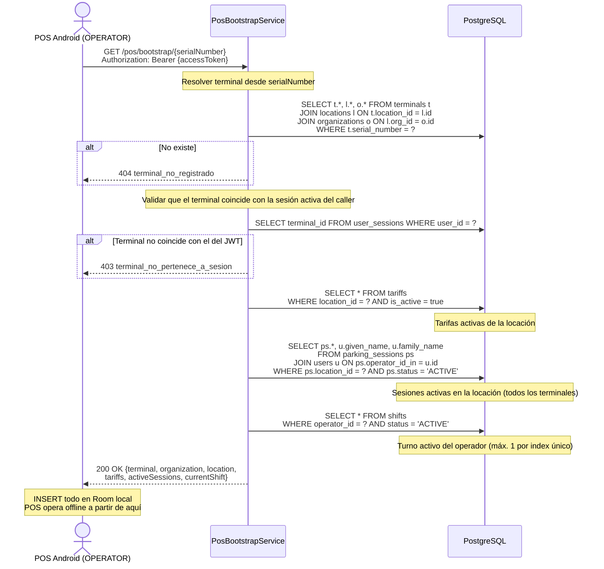

# US-010 — Bootstrap del POS

## Historia de Usuario

**Como** terminal POS Android (OPERATOR autenticado),  
**quiero** obtener todo el contexto de mi sede en una sola llamada después del login,  
**para** operar sin conexión usando los datos almacenados localmente en Room.

---

## Contexto

El POS opera en modo **offline-first**. Luego del login, hace una única llamada al backend que devuelve todo lo necesario para trabajar sin red: datos de la organización, locación, tarifas vigentes, sesiones de estacionamiento activas y el turno actual del operador.

El backend resuelve la cadena completa desde el `serialNumber`:

```
serialNumber
  → terminals
  → terminals.location_id → locations
  → locations.org_id      → organizations
                          → tariffs (is_active = true)
                          → parking_sessions (status = 'ACTIVE')
                          → shifts (operator_id = caller, status = 'ACTIVE')
```

El `operator_id` y `terminal_id` se resuelven desde el JWT y `user_sessions`, **no** del body.

---

## Endpoint

```
GET /pos/bootstrap/{serialNumber}
Authorization: Bearer {accessToken}
```

---

## Criterios de Aceptación

| # | Criterio |
|---|----------|
| AC-1 | Solo usuarios con rol `OPERATOR` pueden llamar a este endpoint. |
| AC-2 | El `serialNumber` del path debe coincidir con el terminal registrado en `user_sessions.terminal_id` del caller. Si no coincide, retorna `403` con `terminal_no_pertenece_a_sesion`. |
| AC-3 | Si el terminal no existe, retorna `404` con `terminal_no_registrado`. |
| AC-4 | Si la locación asociada al terminal no existe o está `INACTIVE`, retorna `503` con `locacion_no_disponible`. |
| AC-5 | `tariffs` contiene solo las tarifas con `is_active = true` de la locación. Si no hay ninguna, retorna lista vacía. |
| AC-6 | `activeSessions` contiene las sesiones de estacionamiento con `status = 'ACTIVE'` en la locación (de todos los terminales). Permite al operador ver vehículos ingresados por otros terminales. |
| AC-7 | `currentShift` contiene el turno activo del operador (`status = 'ACTIVE'`) si existe, o `null` si no tiene turno abierto. |
| AC-8 | La respuesta completa se retorna en una sola query round-trip (joins en el backend). |

---

## Response `200 OK`

```json
{
  "terminal": {
    "id":           "dddddddd-dddd-dddd-dddd-dddddddddddd",
    "serialNumber": "TUU-2024-001",
    "model":        "TUU Pro"
  },
  "organization": {
    "id":    "aaaaaaaa-aaaa-aaaa-aaaa-aaaaaaaaaaaa",
    "name":  "Parking Centro S.A.",
    "rut":   "76.000.000-0",
    "email": "contacto@parkingcentro.cl",
    "phone": "+56912345678"
  },
  "location": {
    "id":       "cccccccc-cccc-cccc-cccc-cccccccccccc",
    "name":     "Sucursal Providencia",
    "address":  "Av. Providencia 1234",
    "city":     "Santiago",
    "timezone": "America/Santiago",
    "capacity": 150
  },
  "tariffs": [
    {
      "id":            "ffffffff-ffff-ffff-ffff-ffffffffffff",
      "vehicleType":   "CAR",
      "name":          "Tarifa Día",
      "pricePerHour":  1500.00,
      "minimumCharge": 500.00,
      "graceMinutes":  10
    },
    {
      "id":            "gggggggg-gggg-gggg-gggg-gggggggggggg",
      "vehicleType":   "MOTORCYCLE",
      "name":          "Tarifa Moto",
      "pricePerHour":  800.00,
      "minimumCharge": 300.00,
      "graceMinutes":  5
    }
  ],
  "activeSessions": [
    {
      "id":           "hhhhhhhh-hhhh-hhhh-hhhh-hhhhhhhhhhhh",
      "plate":        "ABCD12",
      "vehicleType":  "CAR",
      "entryAt":      1234567890,
      "operatorName": "Juan Pérez"
    }
  ],
  "currentShift": {
    "id":          "iiiiiiii-iiii-iiii-iiii-iiiiiiiiiiii",
    "startedAt":   1234567890,
    "openingCash": 50000.00
  }
}
```

> Si el operador no tiene turno activo, `currentShift` es `null`. El POS debe dirigir al operador a abrir un turno (`POST /shifts`) antes de registrar ingresos.

---

## Diagrama de Secuencia



---

## Notas de Implementación

- **Un solo controller**: `/pos/bootstrap` pertenece al paquete `pos/` separado del CRUD estándar, ya que es una vista desnormalizada optimizada para el POS.
- **No hay joins en N+1**: toda la información se resuelve con 4-5 queries directas, no con un ORM que genera subqueries por cada entidad.
- **`entryAt` en Unix epoch (segundos)**: el POS trabaja con `Long` timestamps en Room para evitar conversiones de zona horaria en el cliente.

---

## Archivos Relacionados

| Archivo | Rol |
|---------|-----|
| `pos/PosController.java` | Controlador para endpoints POS (`/pos/**`) |
| `pos/PosBootstrapService.java` | Orquesta las 4-5 queries y arma el response |
| `pos/BootstrapResponse.java` | Record de respuesta completa |
| `pos/BootstrapTerminal.java` | Sub-record del terminal |
| `pos/BootstrapLocation.java` | Sub-record de la locación (con `capacity`) |
| `pos/BootstrapOrganization.java` | Sub-record de la organización |
| `pos/BootstrapTariff.java` | Sub-record de tarifa |
| `pos/BootstrapSession.java` | Sub-record de sesión activa |
| `pos/BootstrapShift.java` | Sub-record del turno |
