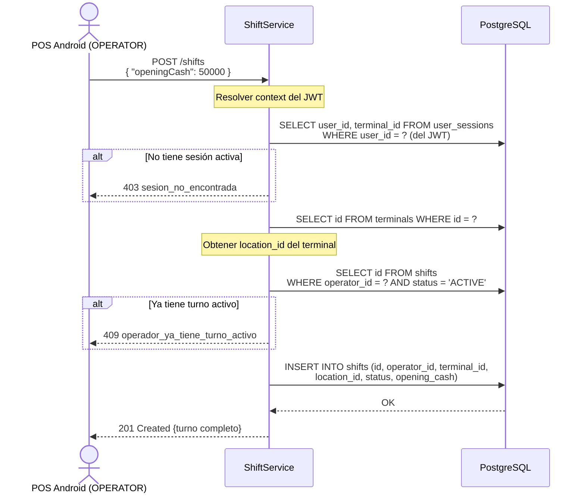

# US-011 — Gestión de Turno

## Historias de Usuario

| ID | Historia |
|----|----------|
| US-011-A | **Como** OPERATOR en el POS, **quiero** abrir un turno indicando el efectivo inicial en caja, **para** registrar el inicio de mi jornada y habilitar el ingreso de vehículos. |
| US-011-B | **Como** OPERATOR en el POS, **quiero** cerrar mi turno con el efectivo final de caja, **para** registrar el cierre de mi jornada. |
| US-011-C | **Como** ADMIN o CUSTOMER en el dashboard web, **quiero** consultar los turnos por fecha u operador, **para** auditar la operación. |

---

## Modelo de Datos

```json
{
  "id":          "uuid",
  "operatorId":  "uuid",
  "terminalId":  "uuid",
  "locationId":  "uuid",
  "status":      "ACTIVE",
  "startedAt":   "2024-01-15T08:00:00Z",
  "closedAt":    null,
  "openingCash": 50000.00,
  "closingCash": null
}
```

---

## Endpoints

| Método | Ruta | Rol | Descripción |
|--------|------|-----|-------------|
| `POST`   | `/shifts`               | OPERATOR | Abrir turno (desde POS) |
| `POST`   | `/shifts/{id}/close`    | OPERATOR | Cerrar turno (desde POS) |
| `GET`    | `/shifts?operatorId=&date=&locationId=` | CUSTOMER | Listar turnos (web dashboard) |
| `GET`    | `/shifts/{id}`          | CUSTOMER | Ver turno (web dashboard) |

---

## US-011-A — Abrir Turno

### Criterios de Aceptación

| # | Criterio |
|---|----------|
| AC-1 | Solo OPERATOR puede abrir un turno. El `operator_id`, `terminal_id` y `location_id` se resuelven del JWT y `user_sessions`. No se envían en el body. |
| AC-2 | Si el operador ya tiene un turno `ACTIVE`, retorna `409` con `operador_ya_tiene_turno_activo`. |
| AC-3 | `openingCash` es obligatorio (puede ser `0`). |
| AC-4 | El turno se crea con `status = ACTIVE` y `started_at = now()`. |
| AC-5 | Retorna `201 Created` con el turno completo. |

### Request

```
POST /shifts
Authorization: Bearer {accessToken del OPERATOR}
Content-Type: application/json

{
  "openingCash": 50000.00
}
```

### Response `201 Created`

```json
{
  "id":          "iiiiiiii-iiii-iiii-iiii-iiiiiiiiiiii",
  "operatorId":  "eeeeeeee-eeee-eeee-eeee-eeeeeeeeeeee",
  "terminalId":  "dddddddd-dddd-dddd-dddd-dddddddddddd",
  "locationId":  "cccccccc-cccc-cccc-cccc-cccccccccccc",
  "status":      "ACTIVE",
  "startedAt":   "2024-01-15T08:00:00Z",
  "closedAt":    null,
  "openingCash": 50000.00,
  "closingCash": null
}
```

### Diagrama de Secuencia



### Errores

| HTTP | Código | Causa |
|------|--------|-------|
| 400  | `opening_cash_requerido` | `openingCash` ausente |
| 403  | `sesion_no_encontrada` | El OPERATOR no tiene sesión activa (no hizo login) |
| 409  | `operador_ya_tiene_turno_activo` | Ya existe un shift `ACTIVE` para este operador |

---

## US-011-B — Cerrar Turno

### Criterios de Aceptación

| # | Criterio |
|---|----------|
| AC-1 | Solo el mismo OPERATOR que abrió el turno puede cerrarlo. |
| AC-2 | `closingCash` es obligatorio (puede ser `0`). |
| AC-3 | Si el turno tiene sesiones de estacionamiento `ACTIVE` al momento del cierre, retorna `409` con `turno_tiene_sesiones_activas`. El operador debe egresar todos los vehículos antes de cerrar. |
| AC-4 | El cierre setea `status = CLOSED` y `closed_at = now()`. |
| AC-5 | Retorna `200 OK` con el turno cerrado. |

### Request

```
POST /shifts/{id}/close
Authorization: Bearer {accessToken del OPERATOR}
Content-Type: application/json

{
  "closingCash": 87500.00
}
```

### Response `200 OK`

```json
{
  "id":          "iiiiiiii-iiii-iiii-iiii-iiiiiiiiiiii",
  "status":      "CLOSED",
  "startedAt":   "2024-01-15T08:00:00Z",
  "closedAt":    "2024-01-15T17:30:00Z",
  "openingCash": 50000.00,
  "closingCash": 87500.00
}
```

### Errores

| HTTP | Código | Causa |
|------|--------|-------|
| 400  | `closing_cash_requerido` | `closingCash` ausente |
| 403  | `turno_no_pertenece_al_operador` | El turno fue abierto por otro operador |
| 404  | `turno_no_encontrado` | El ID no existe |
| 409  | `turno_tiene_sesiones_activas` | Hay vehículos sin egresar en este turno |

---

## US-011-C — Consultar Turnos (Web Dashboard)

### Criterios de Aceptación

| # | Criterio |
|---|----------|
| AC-1 | ADMIN puede listar turnos de cualquier organización. |
| AC-2 | CUSTOMER puede listar solo turnos de locaciones de su organización. |
| AC-3 | Filtros opcionales: `?operatorId=`, `?locationId=`, `?date=YYYY-MM-DD`, `?status=ACTIVE|CLOSED`. |
| AC-4 | Retorna lista vacía `[]` si no hay resultados. |

---

## Archivos Relacionados

| Archivo | Rol |
|---------|-----|
| `shift/ShiftController.java` | REST endpoints |
| `shift/ShiftService.java` | RBAC + validaciones de cierre |
| `shift/ShiftRepository.java` | `insert`, `findById`, `findActive`, `findByOperator`, `close` |
| `shift/Shift.java` | Record de dominio |
| `shift/OpenShiftRequest.java` | Body de apertura |
| `shift/CloseShiftRequest.java` | Body de cierre |
