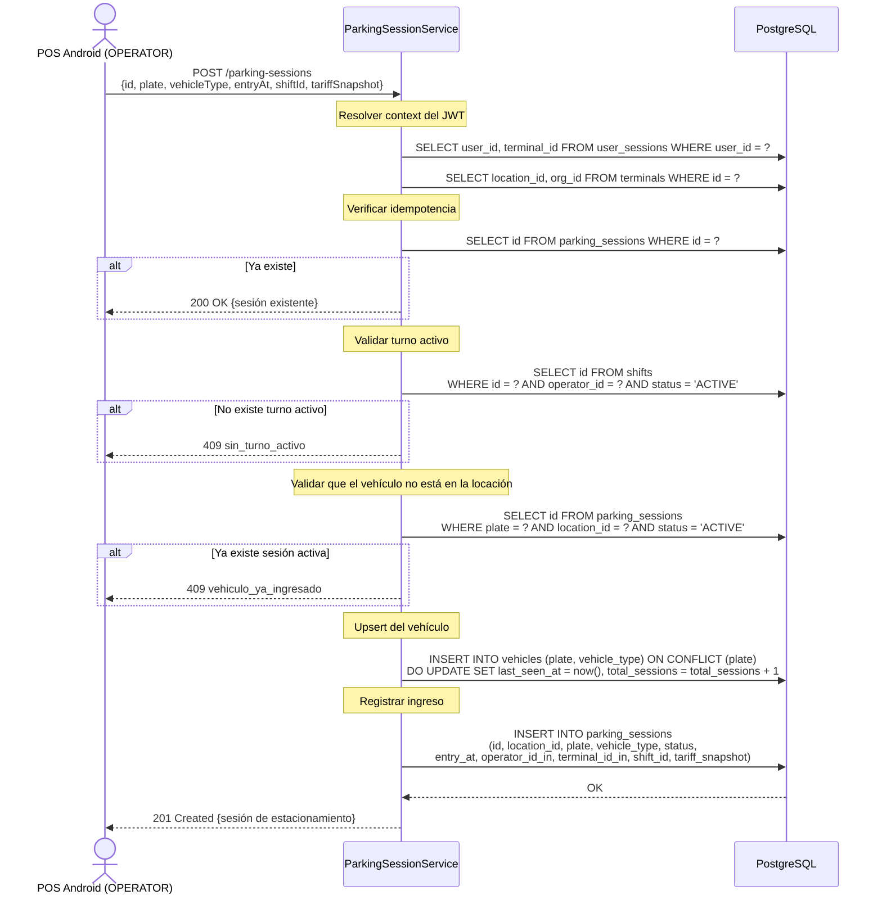

# US-012 — Ingreso de Vehículo

## Historia de Usuario

**Como** OPERATOR en el POS,  
**quiero** registrar el ingreso de un vehículo al estacionamiento,  
**para** iniciar el cobro del tiempo de permanencia.

---

## Contexto de Operación

El POS genera el UUID de la sesión localmente y lo envía al backend. Esto garantiza **idempotencia**: si la misma request llega dos veces (retry por red inestable), el backend la detecta por el `id` ya existente y devuelve `200 OK` sin duplicar el registro.

El `operator_id`, `terminal_id` y `location_id` se resuelven en el backend desde el JWT y `user_sessions`. El POS **no** los envía en el body.

---

## Endpoint

```
POST /parking-sessions
Authorization: Bearer {accessToken del OPERATOR}
Content-Type: application/json
```

---

## Criterios de Aceptación

| # | Criterio |
|---|----------|
| AC-1 | Solo OPERATOR puede registrar ingresos. |
| AC-2 | El operador debe tener un turno `ACTIVE` en el momento del ingreso. Si no tiene turno, retorna `409` con `sin_turno_activo`. |
| AC-3 | `id` (UUID generado por el POS), `plate`, `vehicleType`, `entryAt` (Unix epoch en segundos), `shiftId` y `tariffSnapshot` son obligatorios. |
| AC-4 | Si ya existe una sesión con el mismo `id`, retorna `200 OK` con la sesión existente (idempotencia). |
| AC-5 | Si la placa ya tiene una sesión `ACTIVE` en la misma locación, retorna `409` con `vehiculo_ya_ingresado`. |
| AC-6 | Si la placa no existe en la tabla `vehicles`, se inserta automáticamente. Si ya existe, se actualiza `last_seen_at` y se incrementa `total_sessions`. |
| AC-7 | El `shiftId` debe pertenecer al operador autenticado y estar en estado `ACTIVE`. |
| AC-8 | El `tariffSnapshot` que envía el POS se almacena como JSONB en `tariff_snapshot`. El backend **no** recalcula la tarifa al ingreso. |
| AC-9 | Retorna `201 Created` con la sesión creada. |

---

## Request

```json
{
  "id":          "hhhhhhhh-hhhh-hhhh-hhhh-hhhhhhhhhhhh",
  "plate":       "ABCD12",
  "vehicleType": "CAR",
  "entryAt":     1234567890,
  "shiftId":     "iiiiiiii-iiii-iiii-iiii-iiiiiiiiiiii",
  "tariffSnapshot": {
    "pricePerHour":  1500.00,
    "minimumCharge": 500.00,
    "graceMinutes":  10
  }
}
```

### Campos que el backend resuelve del JWT (no viajan en el body)

| Campo | Fuente |
|-------|--------|
| `operator_id` | `user_sessions.user_id` del caller |
| `terminal_id` | `user_sessions.terminal_id` |
| `location_id` | `terminals.location_id` |

---

## Response `201 Created`

```json
{
  "id":          "hhhhhhhh-hhhh-hhhh-hhhh-hhhhhhhhhhhh",
  "plate":       "ABCD12",
  "vehicleType": "CAR",
  "status":      "ACTIVE",
  "entryAt":     "2024-01-15T10:30:00Z",
  "locationId":  "cccccccc-cccc-cccc-cccc-cccccccccccc",
  "operatorId":  "eeeeeeee-eeee-eeee-eeee-eeeeeeeeeeee",
  "terminalId":  "dddddddd-dddd-dddd-dddd-dddddddddddd",
  "shiftId":     "iiiiiiii-iiii-iiii-iiii-iiiiiiiiiiii",
  "tariffSnapshot": {
    "pricePerHour":  1500.00,
    "minimumCharge": 500.00,
    "graceMinutes":  10
  }
}
```

---

## Diagrama de Secuencia



---

## Errores

| HTTP | Código | Causa |
|------|--------|-------|
| 400  | `campos_requeridos_faltantes` | Falta `plate`, `vehicleType`, `entryAt`, `shiftId` o `tariffSnapshot` |
| 400  | `vehicle_type_invalido` | `vehicleType` no está en `CAR, MOTORCYCLE, PICKUP, BUS` |
| 409  | `sin_turno_activo` | El operador no tiene turno activo |
| 409  | `vehiculo_ya_ingresado` | La placa ya tiene sesión `ACTIVE` en la locación |

---

## Archivos Relacionados

| Archivo | Rol |
|---------|-----|
| `parking/ParkingSessionController.java` | `POST /parking-sessions` |
| `parking/ParkingSessionService.java` | Validaciones + idempotencia + upsert vehículo |
| `parking/ParkingSessionRepository.java` | `insert`, `findById`, `findActiveByPlateAndLocation` |
| `parking/CreateParkingSessionRequest.java` | Record del body |
| `parking/TariffSnapshot.java` | Record del snapshot (mapeado desde/hacia JSONB) |
| `vehicle/VehicleRepository.java` | `upsert(plate, vehicleType)` |
