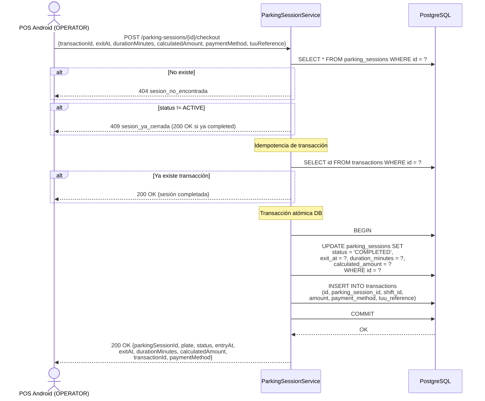

# US-013 — Cobro y Salida de Vehículo

## Historia de Usuario

**Como** OPERATOR en el POS,  
**quiero** registrar el cobro y la salida de un vehículo,  
**para** cerrar la sesión de estacionamiento y generar la transacción de pago.

---

## Contexto de Operación

El POS calcula el monto usando el `tariff_snapshot` guardado localmente al ingreso. El cálculo ocurre en el dispositivo con los datos de Room. El backend recibe el resultado y lo almacena sin recalcular, confiando en el POS.

El POS genera el UUID de la transacción localmente. Si la misma request llega dos veces (retry), el backend detecta el `transactionId` ya existente y responde `200 OK` sin duplicar.

---

## Endpoint

```
POST /parking-sessions/{id}/checkout
Authorization: Bearer {accessToken del OPERATOR}
Content-Type: application/json
```

---

## Criterios de Aceptación

| # | Criterio |
|---|----------|
| AC-1 | Solo OPERATOR puede hacer checkout. |
| AC-2 | La sesión `{id}` debe tener `status = ACTIVE`. Si ya está `COMPLETED` o `CANCELLED`, retorna `409` con `sesion_ya_cerrada` (idempotencia). |
| AC-3 | `transactionId` (UUID del POS), `exitAt` (Unix epoch), `durationMinutes`, `calculatedAmount` y `paymentMethod` son obligatorios. `tuuReference` es opcional. |
| AC-4 | Si ya existe una transacción con el mismo `transactionId`, retorna `200 OK` con la sesión (idempotencia). |
| AC-5 | El backend actualiza `parking_sessions`: `status = COMPLETED`, `exit_at`, `duration_minutes`, `calculated_amount`. |
| AC-6 | El backend inserta en `transactions`: `id = transactionId`, `parking_session_id`, `shift_id` (de la sesión), `amount`, `payment_method`, `tuu_reference`. |
| AC-7 | Ambas operaciones ocurren en una transacción atómica. Si falla alguna, ninguna persiste. |
| AC-8 | `paymentMethod` debe ser uno de: `TUU_CARD`, `TUU_CASH`. |

---

## Request

```json
{
  "transactionId":    "jjjjjjjj-jjjj-jjjj-jjjj-jjjjjjjjjjjj",
  "exitAt":           1234569999,
  "durationMinutes":  33,
  "calculatedAmount": 825.00,
  "paymentMethod":    "TUU_CARD",
  "tuuReference":     "123456789012"
}
```

---

## Response `200 OK`

```json
{
  "parkingSessionId": "hhhhhhhh-hhhh-hhhh-hhhh-hhhhhhhhhhhh",
  "plate":            "ABCD12",
  "status":           "COMPLETED",
  "entryAt":          "2024-01-15T10:30:00Z",
  "exitAt":           "2024-01-15T11:03:00Z",
  "durationMinutes":  33,
  "calculatedAmount": 825.00,
  "transactionId":    "jjjjjjjj-jjjj-jjjj-jjjj-jjjjjjjjjjjj",
  "paymentMethod":    "TUU_CARD"
}
```

---

## Diagrama de Secuencia



---

## Cálculo del Monto (ejecutado en POS, referencia)

El POS calcula usando el `tariff_snapshot` local. El backend almacena el resultado sin recalcular.

```
si durationMinutes <= graceMinutes:
    calculatedAmount = 0
sino:
    billableMinutes = durationMinutes - graceMinutes
    raw = pricePerHour × (billableMinutes / 60)
    calculatedAmount = max(raw, minimumCharge)
```

---

## Errores

| HTTP | Código | Causa |
|------|--------|-------|
| 400  | `campos_requeridos_faltantes` | Falta campo obligatorio |
| 400  | `payment_method_invalido` | Valor fuera de `TUU_CARD, TUU_CASH` |
| 404  | `sesion_no_encontrada` | El ID de sesión no existe |
| 409  | `sesion_ya_cerrada` | La sesión ya está `COMPLETED` o `CANCELLED` |

---

## Archivos Relacionados

| Archivo | Rol |
|---------|-----|
| `parking/ParkingSessionController.java` | `POST /parking-sessions/{id}/checkout` |
| `parking/ParkingSessionService.java` | Idempotencia + transacción atómica |
| `parking/ParkingSessionRepository.java` | `findById`, `complete(id, exitAt, duration, amount)` |
| `parking/CheckoutRequest.java` | Record del body |
| `transaction/TransactionRepository.java` | `insert`, `existsById` |
