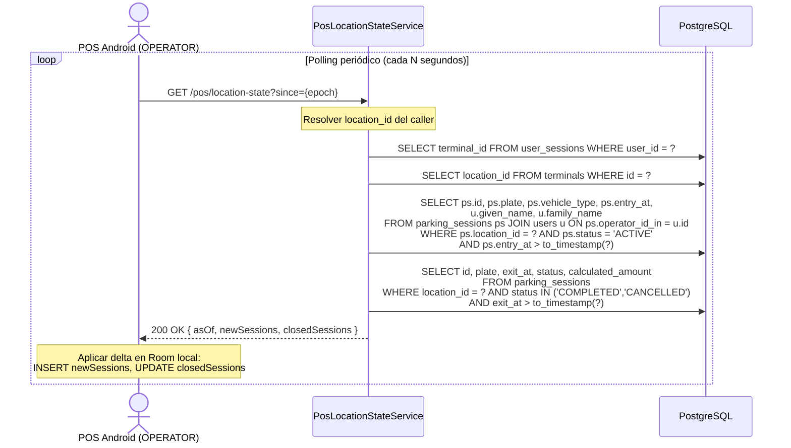

# US-014 — Estado de Locación (Polling Multi-terminal)

## Historia de Usuario

**Como** terminal POS Android (OPERATOR autenticado),  
**quiero** consultar los cambios de estado de la locación desde un timestamp dado,  
**para** mantener mi vista local (Room) sincronizada con lo que hacen otros terminales en la misma sede.

---

## Contexto

Varios terminales pueden operar en simultáneo en la misma locación. Un vehículo ingresado en el terminal A debe aparecer en el terminal B para que el operador B pueda cobrarlo si el operador A se ausenta.

El POS hace polling periódico a este endpoint. Solo trae el **delta** desde `since`, no el estado completo. El POS aplica los cambios sobre su Room local.

---

## Endpoint

```
GET /pos/location-state?since={unixEpoch}
Authorization: Bearer {accessToken del OPERATOR}
```

El `location_id` se resuelve del JWT → `user_sessions` → `terminals.location_id`. El POS no lo envía.

---

## Criterios de Aceptación

| # | Criterio |
|---|----------|
| AC-1 | Solo OPERATOR puede llamar a este endpoint. |
| AC-2 | El parámetro `since` (Unix epoch en segundos) es obligatorio. Retorna `400` con `since_requerido` si se omite. |
| AC-3 | `newSessions` contiene sesiones de estacionamiento con `status = ACTIVE` y `entry_at > since` en la locación del caller. |
| AC-4 | `closedSessions` contiene sesiones con `status = COMPLETED` o `CANCELLED` y `exit_at > since` en la locación del caller. |
| AC-5 | El campo `asOf` en la respuesta indica el timestamp del backend al momento de ejecutar la query. El POS usa este valor como próximo `since`. |
| AC-6 | Retorna `200 OK` con listas vacías si no hubo cambios desde `since`. |
| AC-7 | El backend resuelve la locación del caller desde `user_sessions` + `terminals`, sin parámetro adicional. |

---

## Request

```
GET /pos/location-state?since=1234567890
Authorization: Bearer {accessToken del OPERATOR}
```

---

## Response `200 OK`

```json
{
  "asOf": 1234569999,
  "newSessions": [
    {
      "id":           "kkkkkkkk-kkkk-kkkk-kkkk-kkkkkkkkkkkk",
      "plate":        "XY1234",
      "vehicleType":  "MOTORCYCLE",
      "entryAt":      1234568000,
      "operatorName": "María González"
    }
  ],
  "closedSessions": [
    {
      "id":      "hhhhhhhh-hhhh-hhhh-hhhh-hhhhhhhhhhhh",
      "plate":   "ABCD12",
      "exitAt":  1234569000,
      "status":  "COMPLETED",
      "amount":  825.00
    }
  ]
}
```

---

## Diagrama de Secuencia



---

## Notas de Implementación

- **`since` en Unix epoch (segundos)**: consistente con el resto de timestamps del POS.
- **`asOf`**: el backend registra `Instant.now()` antes de ejecutar las queries y lo retorna como `asOf`. El POS usa ese valor como `since` en la próxima iteración, no el reloj local. Esto evita drift entre relojes del POS y del servidor.
- **Frecuencia de polling sugerida**: 30-60 segundos. El POS decide la frecuencia; el backend no implementa websockets.
- **Sin paginación**: en un escenario real, una locación con >200 cambios por minuto requeriría paginación. Para el MVP, no hay límite explícito.

---

## Errores

| HTTP | Código | Causa |
|------|--------|-------|
| 400  | `since_requerido` | Parámetro `since` ausente |
| 403  | `sesion_no_encontrada` | El OPERATOR no tiene sesión activa en `user_sessions` |

---

## Archivos Relacionados

| Archivo | Rol |
|---------|-----|
| `pos/PosController.java` | `GET /pos/location-state` |
| `pos/PosLocationStateService.java` | Resuelve location + ejecuta las 2 queries delta |
| `pos/LocationStateResponse.java` | Record de respuesta |
| `pos/StateSession.java` | Sub-record de sesión nueva/cerrada |
