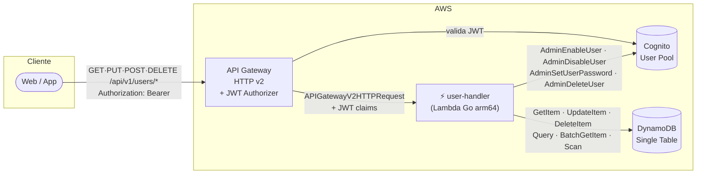
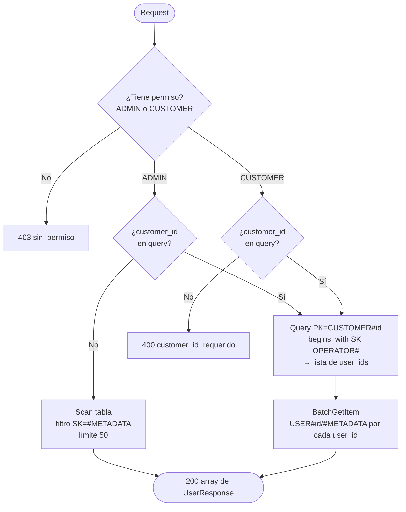

# user-handler

Lambda en Go que gestiona el CRUD de usuarios del sistema.  
Corre en `provided.al2023` / `arm64`. El binario se llama `bootstrap`.

Todos los endpoints requieren **JWT de Cognito** en el header `Authorization: Bearer <token>`.

---

## Arquitectura del componente



---

## Variables de entorno

| Variable | Descripción |
|---|---|
| `COGNITO_USER_POOL_ID` | ID del User Pool (inyectado por Terraform) |
| `DYNAMODB_TABLE_NAME` | Nombre de la tabla DynamoDB principal (inyectado por Terraform) |
| `AWS_REGION` | Región AWS (disponible automáticamente en Lambda) |

---

## Endpoints

| Método | Ruta | ADMIN | CUSTOMER | CUSTOMER_OPERATOR |
|---|---|---|---|---|
| `GET` | `/api/v1/users` | ✅ todos / filtrado | ✅ sus operadores | ❌ |
| `GET` | `/api/v1/users/{id}` | ✅ | ✅ | ✅ solo sí mismo |
| `PUT` | `/api/v1/users/{id}` | ✅ | ✅ | ✅ solo sí mismo |
| `POST` | `/api/v1/users/{id}/activate` | ✅ | ✅ | ❌ |
| `POST` | `/api/v1/users/{id}/deactivate` | ✅ | ✅ | ❌ |
| `POST` | `/api/v1/users/{id}/reset-password` | ✅ | ❌ | ❌ |
| `DELETE` | `/api/v1/users/{id}` | ✅ | ❌ | ❌ |

El router se resuelve con `event.RouteKey`. Los roles se leen de `event.RequestContext.Authorizer.JWT.Claims["cognito:groups"]`.

---

## Structs Go

```go
// ── Handler ────────────────────────────────────────────────────────────────

type Handler struct {
    cognito    *cognitoidentityprovider.Client
    dynamo     *dynamodb.Client
    userPoolID string
    tableName  string
}

// ── DynamoDB item ──────────────────────────────────────────────────────────
// Nombres de atributos: 'email' → 'email_addr', 'status' → 'user_status'
// porque son palabras reservadas en DynamoDB.

type UserItem struct {
    PK         string `dynamodbav:"PK"`           // USER#<id>
    SK         string `dynamodbav:"SK"`           // #METADATA
    GSI1PK     string `dynamodbav:"GSI1PK"`       // COGNITO#<cognito_sub>
    GSI1SK     string `dynamodbav:"GSI1SK"`       // USER#<id>
    GSI2PK     string `dynamodbav:"GSI2PK"`       // EMAIL#<email>
    GSI2SK     string `dynamodbav:"GSI2SK"`       // USER#<id>
    ID         string `dynamodbav:"id"`
    RUT        string `dynamodbav:"rut"`
    Email      string `dynamodbav:"email_addr"`
    GivenName  string `dynamodbav:"given_name"`
    FamilyName string `dynamodbav:"family_name"`
    Phone      string `dynamodbav:"phone_number,omitempty"`
    Role       string `dynamodbav:"role"`
    Status     string `dynamodbav:"user_status"`
    CustomerID string `dynamodbav:"customer_id,omitempty"`
    LocationID string `dynamodbav:"location_id,omitempty"`
    CognitoSub string `dynamodbav:"cognito_sub"`
    CreatedAt  string `dynamodbav:"created_at"`
}

// ── API response ───────────────────────────────────────────────────────────

type UserResponse struct {
    ID         string `json:"id"`
    RUT        string `json:"rut"`
    Email      string `json:"email"`
    GivenName  string `json:"given_name"`
    FamilyName string `json:"family_name"`
    Phone      string `json:"phone_number,omitempty"`
    Role       string `json:"role"`
    Status     string `json:"status"`
    CustomerID string `json:"customer_id,omitempty"`
    LocationID string `json:"location_id,omitempty"`
    CreatedAt  string `json:"created_at"`
}

// ── Requests ───────────────────────────────────────────────────────────────

type UpdateUserRequest struct {
    Email      string `json:"email,omitempty"`
    GivenName  string `json:"given_name,omitempty"`
    FamilyName string `json:"family_name,omitempty"`
    Phone      string `json:"phone_number,omitempty"`
    LocationID string `json:"location_id,omitempty"`
}

type ResetPasswordRequest struct {
    NewPassword string `json:"new_password"`
}
```

---

## Helpers JWT

Los claims del JWT llegan inyectados por API Gateway en el evento:

```go
// Sub del caller (para verificar "solo sí mismo")
func callerSub(event events.APIGatewayV2HTTPRequest) string {
    return event.RequestContext.Authorizer.JWT.Claims["sub"]
}

// String con los grupos del caller (ej: "ADMIN" o "CUSTOMER CUSTOMER_OPERATOR")
func callerGroups(event events.APIGatewayV2HTTPRequest) string {
    return event.RequestContext.Authorizer.JWT.Claims["cognito:groups"]
}

// Verifica si un grupo está presente en el claim (strings.Contains)
func hasGroup(groups, group string) bool {
    return strings.Contains(groups, group)
}
```

---

## Flujo GET /users



---

## Flujo PUT /users/{id}

El UpdateItem usa **DynamoDB Expression Builder** para evitar conflictos con
nombres de atributos reservados (`email`, `name`, `status`, `role`):

```go
update := expression.UpdateBuilder{}
update = update.Set(expression.Name("email_addr"), expression.Value(req.Email))
update = update.Set(expression.Name("given_name"), expression.Value(req.GivenName))
// ...
expr, _ := expression.NewBuilder().WithUpdate(update).Build()

h.dynamo.UpdateItem(ctx, &dynamodb.UpdateItemInput{
    TableName:                 aws.String(h.tableName),
    Key:                       /* PK + SK */,
    UpdateExpression:          expr.Update(),
    ExpressionAttributeNames:  expr.Names(),   // #n0 → "email_addr", etc.
    ExpressionAttributeValues: expr.Values(),
    ConditionExpression:       aws.String("attribute_exists(PK)"),
})
```

---

## Flujo activate / deactivate

Ambas operaciones son síncronas y afectan **DynamoDB y Cognito** en orden:

1. `GetItem` para verificar que el usuario existe y obtener su RUT (username Cognito).
2. `UpdateItem` en DynamoDB → `user_status = ACTIVE | INACTIVE`.
3. `AdminEnableUser` / `AdminDisableUser` en Cognito.

Si el paso 3 falla, el estado de DynamoDB ya fue actualizado — hay inconsistencia temporal. En una versión futura se puede envolver en un paso compensatorio o usar un patrón saga.

---

## Flujo DELETE /users/{id}

```
1. GetItem → obtener RUT del usuario (username en Cognito)
2. DeleteItem DynamoDB: PK=USER#<id>, SK=#METADATA
3. AdminDeleteUser Cognito: Username=rut
```

> El ítem de enlace `CUSTOMER#<cid>/OPERATOR#<id>` **no se elimina automáticamente**.
> Esta limpieza queda pendiente para una operación de mantenimiento futura.

---

## cURL de prueba

Primero obtener un token con el auth-handler:

```bash
TOKEN=$(curl -s -X POST https://qnehzrs7g4.execute-api.us-east-1.amazonaws.com/api/v1/auth/login \
  -H "Content-Type: application/json" \
  -d '{"rut":"12345678-5","password":"Temporal123!"}' | jq -r '.access_token')
```

### Listar operadores de un cliente

```bash
curl -s https://qnehzrs7g4.execute-api.us-east-1.amazonaws.com/api/v1/users?customer_id=c0c0c0c0-... \
  -H "Authorization: Bearer $TOKEN" | jq
```

### Obtener un usuario por ID

```bash
curl -s https://qnehzrs7g4.execute-api.us-east-1.amazonaws.com/api/v1/users/a1b2c3d4-... \
  -H "Authorization: Bearer $TOKEN" | jq
```

### Actualizar nombre y teléfono

```bash
curl -s -X PUT https://qnehzrs7g4.execute-api.us-east-1.amazonaws.com/api/v1/users/a1b2c3d4-... \
  -H "Authorization: Bearer $TOKEN" \
  -H "Content-Type: application/json" \
  -d '{"given_name":"Juan Carlos","phone_number":"+56987654321"}' | jq
```

### Desactivar usuario

```bash
curl -s -X POST https://qnehzrs7g4.execute-api.us-east-1.amazonaws.com/api/v1/users/a1b2c3d4-.../deactivate \
  -H "Authorization: Bearer $TOKEN" | jq
```

### Resetear contraseña (solo ADMIN)

```bash
curl -s -X POST https://qnehzrs7g4.execute-api.us-east-1.amazonaws.com/api/v1/users/a1b2c3d4-.../reset-password \
  -H "Authorization: Bearer $TOKEN" \
  -H "Content-Type: application/json" \
  -d '{"new_password":"NuevoPass456!"}' | jq
```

### Eliminar usuario (solo ADMIN)

```bash
curl -s -X DELETE https://qnehzrs7g4.execute-api.us-east-1.amazonaws.com/api/v1/users/a1b2c3d4-... \
  -H "Authorization: Bearer $TOKEN" | jq
```

---

## Estructura de archivos

```
user-handler/
├── README.md
├── go.mod
├── go.sum
├── docs/
│   └── openapi.yaml
├── main.go              ← entry point, inicializa clientes Cognito y DynamoDB
├── handler.go           ← Handler struct, router, jsonResponse, callerSub/Groups/hasGroup
├── model.go             ← UserItem, UserResponse, toResponse
├── list.go              ← ListUsers: listByCustomer (Query+BatchGet) + scanAllUsers
├── get.go               ← GetUser + fetchUser (helper reutilizado por otros handlers)
├── update.go            ← UpdateUser con expression builder
├── status.go            ← SetUserStatus (activate / deactivate)
├── reset_password.go    ← ResetPassword
└── delete.go            ← DeleteUser
```

---

## Dependencias Go

```
github.com/aws/aws-lambda-go
github.com/aws/aws-sdk-go-v2/config
github.com/aws/aws-sdk-go-v2/service/cognitoidentityprovider
github.com/aws/aws-sdk-go-v2/service/dynamodb
github.com/aws/aws-sdk-go-v2/feature/dynamodb/attributevalue
github.com/aws/aws-sdk-go-v2/feature/dynamodb/expression
```
